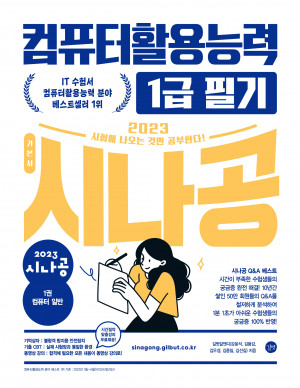

# 컴퓨터 활용 능력 1급 필기
###### 컴퓨터 활용 능력 1급 필기의 경우 문제 오답 노트노 함께 정리되어 있습니다.

고등학교 시절 컴퓨터활용능력 1급 취득을 목표로 2023년도 교재를 구매했지만, 당시에는 끝내 제대로 시작하지 못했습니다.  
시간이 흐른 뒤 회사 생활과 학습을 병행하게 되면서, 더 이상 미뤄두기보다 이번에는 직접 정리하며 끝까지 완주해보고자 다시 책을 펼치게 되었습니다.

이 README는 2023년도 교재를 바탕으로 컴퓨터활용능력 1급의 핵심 개념과 중요한 내용을 정리한 기록입니다. 자격증 취득에만 목적을 두기보다는,  
실무와도 연결될 수 있는 기본기를 함께 다지는 과정으로 남기고자 합니다.

**제가 책을 정독하면서 느꼈지만 1과목의 경우 3장 -> 4장 -> 5장 -> 6장 -> 7장 -> 8장 -> 1장 -> 2장 순으로 정독하는  
것이 문제 푸는데 있어 많이 도움이 된 것 같습니다.**

## 목차
### 1과목 컴퓨터 일반
- 1장 한글 Windows의 기본
    - <a href="">001. 한글 Windows 10의 특징</a>
    - <a href="">002. 한글 Windows 10의 시작과 종료</a>
    - <a href="">003. 바로 가기 키</a>
    - <a href="">004. 바탕화면 / 바로가기 아이콘</a>
    - <a href="">005. 작업 표시줄</a>
    - <a href="">006. 작업 표시줄 - 작업 보기 / 가상 데스크톱 도구 모음</a>
    - <a href="">007. 시작 메뉴</a>
    - <a href="">008. 파일 탐색기</a>
    - <a href="">009. 파일 탐색기의 구성 요소</a>
    - <a href="">010. 폴더 옵션</a>
    - <a href="">011. 디스크 관리</a>
    - <a href="">012. 파일과 폴더</a>
    - <a href="">013. 파일 / 폴더 - 선택 / 복사 / 이동 / 삭제</a>
    - <a href="">014. 검색 상자</a>
    - <a href="">015. 휴지통 사용하기</a>
    - <a href="">016. Windows 보조프로그램</a>
    - <a href="">017. 유니버설 앱</a>
- 2장 한글 Windows 10의 고급 기능
    - <a href="">018. 설정 창</a>
    - <a href="">019. 설정 창의 시스템</a>
    - <a href="">020. 설정 창의 개인 설정</a>
    - <a href="">021. 설정 창의 앱</a>
    - <a href="">022. 설정 창의 접근성</a>
    - <a href="">023. 설정 창의 계정 / 개인 정보</a>
    - <a href="">024. 설정 창의 업데이트 및 보안</a>
    - <a href="">025. 설정 창의 장치 / 시간 및 언어</a>
    - <a href="">026. 하드웨어 추가/제거 / 장치 관리자</a>
    - <a href="">027. 프린터</a>
    - <a href="">028. 스풀 기능 / 인쇄 작업</a>
    - <a href="">029. Windows 관리 도구 - 드라이브 조각 모음 및 최적화 / 디스크 정리</a>
    - <a href="">030. Windows 시스템 - 작업 관리자 / 명령 프롬프트</a>
    - <a href="">031. 시스템 유지 관리 - 드라이브 오류 검사</a>
    - <a href="">032. 네트워크</a>
    - <a href="">033. 기본 네트워크 정보 및 연결 설정</a>
    - <a href="">034. 문제 해결</a>
- 3장 컴퓨터 시스템의 개요
    - <a herf="">035. 컴퓨터의 개념</a>
    - <a herf="">036. 자료 구성의 단위</a>
    - <a herf="">037. 자료 구성의 단위</a>
    - <a herf="">038. 수의 표현 및 연산</a>
    - <a herf="">039. 자료의 표현 방식</a>
- 4장 컴퓨터 하드웨어
    - <a href="">040. 중앙처리장치</a>
    - <a href="">041. 주기억장치</a>
    - <a href="">042. 보조기억장치</a>
    - <a href="">043. 출력장치</a>
    - <a href="">044. 인터럽트 / 채널 / DMA</a>
    - <a href="">045. 마이크로프로세서</a>
    - <a href="">048. 바이오스 / 펌웨어</a>
    - <a href="">049. 하드디스크 연결 방식</a>
    - <a href="">050. PC 관리</a>
    - <a href="">051. PC 업그레이드</a>
    - <a href="">052. PC 응급처치</a>
- 5장 컴퓨터 소프트웨어
    - <a href="">053. 소프트웨어의 개요</a>
    - <a href="">054. 운영체제</a>
    - <a href="">055. 운영체제의 운영 방식</a>
    - <a href="">056. 프로그래밍 언어</a>
    - <a href="">057. 웹 프로그래밍 언어</a>
- 6장 인터넷 활용
    - <a href="">058. 정보통신의 이해</a>
    - <a href="">059. 망 구성과 네트워크 장비</a>
    - <a href="">060. 인터넷의 개요</a>
    - <a href="">061. 인터넷의 주소 체계</a>
    - <a href="">062. 프로토콜</a>
    - <a href="">063. 인터넷 서비스</a>
    - <a href="">064. 웹 브라우저 / 검색 엔진</a>
    - <a href="">065. 정보통신 기술 활용</a>
- 7장 멀티미디어 활용
    - <a href="">066. 멀티미디어</a>
    - <a href="">067. 멀티미디어 하드웨어</a>
    - <a href="">068. 멀티미디어 소프트웨어</a>
    - <a href="">069. 멀티미디어 그래픽 데이터</a>
    - <a href="">070. 멀티미디어 오디오 / 비디오 데이터</a>
    - <a href="">071. 멀티미디어 활용</a>
- 8장 컴퓨터 시스템 보호
    - <a href="">072. 정보 사회</a>
    - <a href="">073. 정보 사회 윤리</a>
    - <a href="">074. 저작권 보호</a>
    - <a href="">075. 바이러스 / 백신</a>
    - <a href="">076. 정보보안 개요</a>
    - <a href="">077. 정보 보안 기법</a>
### 2과목 스프레드시트 일반
### 3과목 데이터베이스 일반