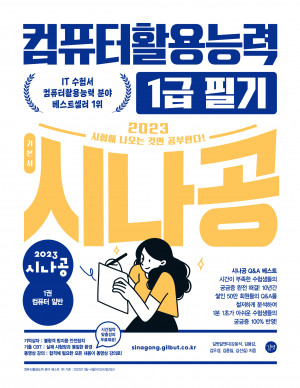

# 컴퓨터 활용 능력 1급 필기
###### 컴퓨터 활용 능력 1급 필기의 경우 문제 오답 노트노 함께 정리되어 있습니다.

고등학교 시절 컴퓨터활용능력 1급 취득을 목표로 2023년도 교재를 구매했지만, 당시에는 끝내 제대로 시작하지 못했습니다.  
시간이 흐른 뒤 회사 생활과 학습을 병행하게 되면서, 더 이상 미뤄두기보다 이번에는 직접 정리하며 끝까지 완주해보고자 다시 책을 펼치게 되었습니다.

이 README는 2023년도 교재를 바탕으로 컴퓨터활용능력 1급의 핵심 개념과 중요한 내용을 정리한 기록입니다. 자격증 취득에만 목적을 두기보다는,  
실무와도 연결될 수 있는 기본기를 함께 다지는 과정으로 남기고자 합니다.

**제가 책을 정독하면서 느꼈지만 1과목의 경우 3장 -> 4장 -> 5장 -> 6장 -> 7장 -> 8장 -> 1장 -> 2장 순으로 정독하는  
것이 문제 푸는데 있어 많이 도움이 된 것 같습니다.**

> **그리고 해당 2과목과 3과목은 정리에서 제외 하도록 하겠습니다.**
> **저에게 있어 지금 가장 중요한 부분은 컴퓨터에 대한 이해이기 때문에 컴퓨터 일반 과목만 정리하고 나머지는 제 개인 노션에만 정리 하였습니다.**

## 목차
### 1과목 컴퓨터 일반
- 1장 한글 Windows의 기본
    - <a href="./1%EA%B3%BC%EB%AA%A9%20%EC%BB%B4%ED%93%A8%ED%84%B0%20%EC%9D%BC%EB%B0%98/1%EC%9E%A5%20%ED%95%9C%EA%B8%80%20Windows%2010%EC%9D%98%20%EA%B8%B0%EB%B3%B8/001.%20%ED%95%9C%EA%B8%80%20Windows%2010%EC%9D%98%20%ED%8A%B9%EC%A7%95.md">001. 한글 Windows 10의 특징</a>
    - <a href="./1%EA%B3%BC%EB%AA%A9%20%EC%BB%B4%ED%93%A8%ED%84%B0%20%EC%9D%BC%EB%B0%98/1%EC%9E%A5%20%ED%95%9C%EA%B8%80%20Windows%2010%EC%9D%98%20%EA%B8%B0%EB%B3%B8/002.%20%ED%95%9C%EA%B8%80%20Windows%2010%EC%9D%98%20%EC%8B%9C%EC%9E%91%EA%B3%BC%20%EC%A2%85%EB%A3%8C.md">002. 한글 Windows 10의 시작과 종료</a>
    - <a href="./1%EA%B3%BC%EB%AA%A9%20%EC%BB%B4%ED%93%A8%ED%84%B0%20%EC%9D%BC%EB%B0%98/1%EC%9E%A5%20%ED%95%9C%EA%B8%80%20Windows%2010%EC%9D%98%20%EA%B8%B0%EB%B3%B8/003.%20%EB%B0%94%EB%A1%9C%20%EA%B0%80%EA%B8%B0%20%ED%82%A4.md">003. 바로 가기 키</a>
    - <a href="./1%EA%B3%BC%EB%AA%A9%20%EC%BB%B4%ED%93%A8%ED%84%B0%20%EC%9D%BC%EB%B0%98/1%EC%9E%A5%20%ED%95%9C%EA%B8%80%20Windows%2010%EC%9D%98%20%EA%B8%B0%EB%B3%B8/004.%20%EB%B0%94%ED%83%95%ED%99%94%EB%A9%B4%20%26%20%EB%B0%94%EB%A1%9C%EA%B0%80%EA%B8%B0%20%EC%95%84%EC%9D%B4%EC%BD%98.md">004. 바탕화면 / 바로가기 아이콘</a>
    - <a href="./1%EA%B3%BC%EB%AA%A9%20%EC%BB%B4%ED%93%A8%ED%84%B0%20%EC%9D%BC%EB%B0%98/1%EC%9E%A5%20%ED%95%9C%EA%B8%80%20Windows%2010%EC%9D%98%20%EA%B8%B0%EB%B3%B8/005.%20%EC%9E%91%EC%97%85%20%ED%91%9C%EC%8B%9C%EC%A4%84.md">005. 작업 표시줄</a>
    - <a href="./1%EA%B3%BC%EB%AA%A9%20%EC%BB%B4%ED%93%A8%ED%84%B0%20%EC%9D%BC%EB%B0%98/1%EC%9E%A5%20%ED%95%9C%EA%B8%80%20Windows%2010%EC%9D%98%20%EA%B8%B0%EB%B3%B8/006.%20%EC%9E%91%EC%97%85%20%ED%91%9C%EC%8B%9C%EC%A4%84%20-%20%EC%9E%91%EC%97%85%20%EB%B3%B4%EA%B8%B0%20%EF%BC%8F%20%EA%B0%80%EC%83%81%20%EB%8D%B0%EC%8A%A4%ED%81%AC%ED%86%B1%20%EB%8F%84%EA%B5%AC%20%EB%AA%A8%EC%9D%8C.md">006. 작업 표시줄 - 작업 보기 / 가상 데스크톱 도구 모음</a>
    - <a href="./1%EA%B3%BC%EB%AA%A9%20%EC%BB%B4%ED%93%A8%ED%84%B0%20%EC%9D%BC%EB%B0%98/1%EC%9E%A5%20%ED%95%9C%EA%B8%80%20Windows%2010%EC%9D%98%20%EA%B8%B0%EB%B3%B8/007.%20%EC%8B%9C%EC%9E%91%20%EB%A9%94%EB%89%B4.md">007. 시작 메뉴</a>
    - <a href="./1%EA%B3%BC%EB%AA%A9%20%EC%BB%B4%ED%93%A8%ED%84%B0%20%EC%9D%BC%EB%B0%98/1%EC%9E%A5%20%ED%95%9C%EA%B8%80%20Windows%2010%EC%9D%98%20%EA%B8%B0%EB%B3%B8/008.%20%ED%8C%8C%EC%9D%BC%20%ED%83%90%EC%83%89%EA%B8%B0.md">008. 파일 탐색기</a>
    - <a href="./1%EA%B3%BC%EB%AA%A9%20%EC%BB%B4%ED%93%A8%ED%84%B0%20%EC%9D%BC%EB%B0%98/1%EC%9E%A5%20%ED%95%9C%EA%B8%80%20Windows%2010%EC%9D%98%20%EA%B8%B0%EB%B3%B8/009.%20%ED%8C%8C%EC%9D%BC%20%ED%83%90%EC%83%89%EA%B8%B0%EC%9D%98%20%EA%B5%AC%EC%84%B1%20%EC%9A%94%EC%86%8C.md">009. 파일 탐색기의 구성 요소</a>
    - <a href="./1%EA%B3%BC%EB%AA%A9%20%EC%BB%B4%ED%93%A8%ED%84%B0%20%EC%9D%BC%EB%B0%98/1%EC%9E%A5%20%ED%95%9C%EA%B8%80%20Windows%2010%EC%9D%98%20%EA%B8%B0%EB%B3%B8/010.%20%ED%8F%B4%EB%8D%94%20%EC%98%B5%EC%85%98.md">010. 폴더 옵션</a>
    - <a href="./1%EA%B3%BC%EB%AA%A9%20%EC%BB%B4%ED%93%A8%ED%84%B0%20%EC%9D%BC%EB%B0%98/1%EC%9E%A5%20%ED%95%9C%EA%B8%80%20Windows%2010%EC%9D%98%20%EA%B8%B0%EB%B3%B8/011.%20%EB%94%94%EC%8A%A4%ED%81%AC%20%EA%B4%80%EB%A6%AC.md">011. 디스크 관리</a>
    - <a href="./1%EA%B3%BC%EB%AA%A9%20%EC%BB%B4%ED%93%A8%ED%84%B0%20%EC%9D%BC%EB%B0%98/1%EC%9E%A5%20%ED%95%9C%EA%B8%80%20Windows%2010%EC%9D%98%20%EA%B8%B0%EB%B3%B8/012.%20%ED%8C%8C%EC%9D%BC%EA%B3%BC%20%ED%8F%B4%EB%8D%94.md">012. 파일과 폴더</a>
    - <a href="./1%EA%B3%BC%EB%AA%A9%20%EC%BB%B4%ED%93%A8%ED%84%B0%20%EC%9D%BC%EB%B0%98/1%EC%9E%A5%20%ED%95%9C%EA%B8%80%20Windows%2010%EC%9D%98%20%EA%B8%B0%EB%B3%B8/013.%20%ED%8C%8C%EC%9D%BC%20%EF%BC%8F%20%ED%8F%B4%EB%8D%94%20-%20%EC%84%A0%ED%83%9D%20%EF%BC%8F%20%EB%B3%B5%EC%82%AC%20%EF%BC%8F%20%EC%9D%B4%EB%8F%99%20%EF%BC%8F%20%EC%82%AD%EC%A0%9C.md">013. 파일 / 폴더 - 선택 / 복사 / 이동 / 삭제</a>
    - <a href="./1%EA%B3%BC%EB%AA%A9%20%EC%BB%B4%ED%93%A8%ED%84%B0%20%EC%9D%BC%EB%B0%98/1%EC%9E%A5%20%ED%95%9C%EA%B8%80%20Windows%2010%EC%9D%98%20%EA%B8%B0%EB%B3%B8/014.%20%EA%B2%80%EC%83%89%20%EC%83%81%EC%9E%90.md">014. 검색 상자</a>
    - <a href="./1%EA%B3%BC%EB%AA%A9%20%EC%BB%B4%ED%93%A8%ED%84%B0%20%EC%9D%BC%EB%B0%98/1%EC%9E%A5%20%ED%95%9C%EA%B8%80%20Windows%2010%EC%9D%98%20%EA%B8%B0%EB%B3%B8/015.%20%ED%9C%B4%EC%A7%80%ED%86%B5%20%EC%82%AC%EC%9A%A9%ED%95%98%EA%B8%B0.md">015. 휴지통 사용하기</a>
    - <a href="./1%EA%B3%BC%EB%AA%A9%20%EC%BB%B4%ED%93%A8%ED%84%B0%20%EC%9D%BC%EB%B0%98/1%EC%9E%A5%20%ED%95%9C%EA%B8%80%20Windows%2010%EC%9D%98%20%EA%B8%B0%EB%B3%B8/016.%20Windows%20%EB%B3%B4%EC%A1%B0%ED%94%84%EB%A1%9C%EA%B7%B8%EB%9E%A8.md">016. Windows 보조프로그램</a>
    - <a href="./1%EA%B3%BC%EB%AA%A9%20%EC%BB%B4%ED%93%A8%ED%84%B0%20%EC%9D%BC%EB%B0%98/1%EC%9E%A5%20%ED%95%9C%EA%B8%80%20Windows%2010%EC%9D%98%20%EA%B8%B0%EB%B3%B8/017.%20%EC%9C%A0%EB%8B%88%EB%B2%84%EC%84%A4%20%EC%95%B1.md">017. 유니버설 앱</a>
- 2장 한글 Windows 10의 고급 기능
    - <a href="./1%EA%B3%BC%EB%AA%A9%20%EC%BB%B4%ED%93%A8%ED%84%B0%20%EC%9D%BC%EB%B0%98/2%EC%9E%A5%20%ED%95%9C%EA%B8%80%20Windows%2010%EC%9D%98%20%EA%B3%A0%EA%B8%89%20%EA%B8%B0%EB%8A%A5/018.%20%EC%84%A4%EC%A0%95%20%EC%B0%BD.md">018. 설정 창</a>
    - <a href="./1%EA%B3%BC%EB%AA%A9%20%EC%BB%B4%ED%93%A8%ED%84%B0%20%EC%9D%BC%EB%B0%98/2%EC%9E%A5%20%ED%95%9C%EA%B8%80%20Windows%2010%EC%9D%98%20%EA%B3%A0%EA%B8%89%20%EA%B8%B0%EB%8A%A5/019.%20%EC%84%A4%EC%A0%95%20%EC%B0%BD%EC%9D%98%20%EC%8B%9C%EC%8A%A4%ED%85%9C.md">019. 설정 창의 시스템</a>
    - <a href="./1%EA%B3%BC%EB%AA%A9%20%EC%BB%B4%ED%93%A8%ED%84%B0%20%EC%9D%BC%EB%B0%98/2%EC%9E%A5%20%ED%95%9C%EA%B8%80%20Windows%2010%EC%9D%98%20%EA%B3%A0%EA%B8%89%20%EA%B8%B0%EB%8A%A5/020.%20%EC%84%A4%EC%A0%95%20%EC%B0%BD%EC%9D%98%20%EA%B0%9C%EC%9D%B8%20%EC%84%A4%EC%A0%95.md">020. 설정 창의 개인 설정</a>
    - <a href="./1%EA%B3%BC%EB%AA%A9%20%EC%BB%B4%ED%93%A8%ED%84%B0%20%EC%9D%BC%EB%B0%98/2%EC%9E%A5%20%ED%95%9C%EA%B8%80%20Windows%2010%EC%9D%98%20%EA%B3%A0%EA%B8%89%20%EA%B8%B0%EB%8A%A5/021.%20%EC%84%A4%EC%A0%95%20%EC%B0%BD%EC%9D%98%20%EC%95%B1.md">021. 설정 창의 앱</a>
    - <a href="./1%EA%B3%BC%EB%AA%A9%20%EC%BB%B4%ED%93%A8%ED%84%B0%20%EC%9D%BC%EB%B0%98/2%EC%9E%A5%20%ED%95%9C%EA%B8%80%20Windows%2010%EC%9D%98%20%EA%B3%A0%EA%B8%89%20%EA%B8%B0%EB%8A%A5/022.%20%EC%84%A4%EC%A0%95%20%EC%B0%BD%EC%9D%98%20%EC%A0%91%EA%B7%BC%EC%84%B1.md">022. 설정 창의 접근성</a>
    - <a href="./1%EA%B3%BC%EB%AA%A9%20%EC%BB%B4%ED%93%A8%ED%84%B0%20%EC%9D%BC%EB%B0%98/2%EC%9E%A5%20%ED%95%9C%EA%B8%80%20Windows%2010%EC%9D%98%20%EA%B3%A0%EA%B8%89%20%EA%B8%B0%EB%8A%A5/023.%20%EC%84%A4%EC%A0%95%20%EC%B0%BD%EC%9D%98%20%EA%B3%84%EC%A0%95%20%EF%BC%8F%20%EA%B0%9C%EC%9D%B8%20%EC%A0%95%EB%B3%B4.md">023. 설정 창의 계정 / 개인 정보</a>
    - <a href="./1%EA%B3%BC%EB%AA%A9%20%EC%BB%B4%ED%93%A8%ED%84%B0%20%EC%9D%BC%EB%B0%98/2%EC%9E%A5%20%ED%95%9C%EA%B8%80%20Windows%2010%EC%9D%98%20%EA%B3%A0%EA%B8%89%20%EA%B8%B0%EB%8A%A5/024.%20%EC%84%A4%EC%A0%95%20%EC%B0%BD%EC%9D%98%20%EC%97%85%EB%8D%B0%EC%9D%B4%ED%8A%B8%20%EB%B0%8F%20%EB%B3%B4%EC%95%88.md">024. 설정 창의 업데이트 및 보안</a>
    - <a href="./1%EA%B3%BC%EB%AA%A9%20%EC%BB%B4%ED%93%A8%ED%84%B0%20%EC%9D%BC%EB%B0%98/2%EC%9E%A5%20%ED%95%9C%EA%B8%80%20Windows%2010%EC%9D%98%20%EA%B3%A0%EA%B8%89%20%EA%B8%B0%EB%8A%A5/025.%20%EC%84%A4%EC%A0%95%20%EC%B0%BD%EC%9D%98%20%EC%9E%A5%EC%B9%98%20%EF%BC%8F%20%EC%8B%9C%EA%B0%84%20%EB%B0%8F%20%EC%96%B8%EC%96%B4.md">025. 설정 창의 장치 / 시간 및 언어</a>
    - <a href="./1%EA%B3%BC%EB%AA%A9%20%EC%BB%B4%ED%93%A8%ED%84%B0%20%EC%9D%BC%EB%B0%98/2%EC%9E%A5%20%ED%95%9C%EA%B8%80%20Windows%2010%EC%9D%98%20%EA%B3%A0%EA%B8%89%20%EA%B8%B0%EB%8A%A5/026.%20%ED%95%98%EB%93%9C%EC%9B%A8%EC%96%B4%20%EC%B6%94%EA%B0%80%EC%A0%9C%EA%B1%B0%20%EF%BC%8F%20%EC%9E%A5%EC%B9%98%20%EA%B4%80%EB%A6%AC%EC%9E%90.md">026. 하드웨어 추가/제거 / 장치 관리자</a>
    - <a href="./1%EA%B3%BC%EB%AA%A9%20%EC%BB%B4%ED%93%A8%ED%84%B0%20%EC%9D%BC%EB%B0%98/2%EC%9E%A5%20%ED%95%9C%EA%B8%80%20Windows%2010%EC%9D%98%20%EA%B3%A0%EA%B8%89%20%EA%B8%B0%EB%8A%A5/027.%20%ED%94%84%EB%A6%B0%ED%84%B0.md">027. 프린터</a>
    - <a href="./1%EA%B3%BC%EB%AA%A9%20%EC%BB%B4%ED%93%A8%ED%84%B0%20%EC%9D%BC%EB%B0%98/2%EC%9E%A5%20%ED%95%9C%EA%B8%80%20Windows%2010%EC%9D%98%20%EA%B3%A0%EA%B8%89%20%EA%B8%B0%EB%8A%A5/028.%20%EC%8A%A4%ED%92%80%20%EA%B8%B0%EB%8A%A5%20%EF%BC%8F%20%EC%9D%B8%EC%87%84%20%EC%9E%91%EC%97%85.md">028. 스풀 기능 / 인쇄 작업</a>
    - <a href="./1%EA%B3%BC%EB%AA%A9%20%EC%BB%B4%ED%93%A8%ED%84%B0%20%EC%9D%BC%EB%B0%98/2%EC%9E%A5%20%ED%95%9C%EA%B8%80%20Windows%2010%EC%9D%98%20%EA%B3%A0%EA%B8%89%20%EA%B8%B0%EB%8A%A5/029.%20Windows%20%EA%B4%80%EB%A6%AC%20%EB%8F%84%EA%B5%AC%20-%20%EB%93%9C%EB%9D%BC%EC%9D%B4%EB%B8%8C%20%EC%A1%B0%EA%B0%81%20%EB%AA%A8%EC%9D%8C%20%EB%B0%8F%20%EC%B5%9C%EC%A0%81%ED%99%94%20%EF%BC%8F%20%EB%94%94%EC%8A%A4%ED%81%AC%20%EC%A0%95%EB%A6%AC.md">029. Windows 관리 도구 - 드라이브 조각 모음 및 최적화 / 디스크 정리</a>
    - <a href="./1%EA%B3%BC%EB%AA%A9%20%EC%BB%B4%ED%93%A8%ED%84%B0%20%EC%9D%BC%EB%B0%98/2%EC%9E%A5%20%ED%95%9C%EA%B8%80%20Windows%2010%EC%9D%98%20%EA%B3%A0%EA%B8%89%20%EA%B8%B0%EB%8A%A5/030.%20Windows%20%EC%8B%9C%EC%8A%A4%ED%85%9C%20-%20%EC%9E%91%EC%97%85%20%EA%B4%80%EB%A6%AC%EC%9E%90%20%EF%BC%8F%20%EB%AA%85%EB%A0%B9%20%ED%94%84%EB%A1%AC%ED%94%84%ED%8A%B8.md">030. Windows 시스템 - 작업 관리자 / 명령 프롬프트</a>
    - <a href="./1%EA%B3%BC%EB%AA%A9%20%EC%BB%B4%ED%93%A8%ED%84%B0%20%EC%9D%BC%EB%B0%98/2%EC%9E%A5%20%ED%95%9C%EA%B8%80%20Windows%2010%EC%9D%98%20%EA%B3%A0%EA%B8%89%20%EA%B8%B0%EB%8A%A5/031.%20%EC%8B%9C%EC%8A%A4%ED%85%9C%20%EC%9C%A0%EC%A7%80%20%EA%B4%80%EB%A6%AC%20-%20%EB%93%9C%EB%9D%BC%EC%9D%B4%EB%B8%8C%20%EC%98%A4%EB%A5%98%20%EA%B2%80%EC%82%AC.md">031. 시스템 유지 관리 - 드라이브 오류 검사</a>
    - <a href="./1%EA%B3%BC%EB%AA%A9%20%EC%BB%B4%ED%93%A8%ED%84%B0%20%EC%9D%BC%EB%B0%98/2%EC%9E%A5%20%ED%95%9C%EA%B8%80%20Windows%2010%EC%9D%98%20%EA%B3%A0%EA%B8%89%20%EA%B8%B0%EB%8A%A5/032.%20%EB%84%A4%ED%8A%B8%EC%9B%8C%ED%81%AC.md">032. 네트워크</a>
    - <a href="./1%EA%B3%BC%EB%AA%A9%20%EC%BB%B4%ED%93%A8%ED%84%B0%20%EC%9D%BC%EB%B0%98/2%EC%9E%A5%20%ED%95%9C%EA%B8%80%20Windows%2010%EC%9D%98%20%EA%B3%A0%EA%B8%89%20%EA%B8%B0%EB%8A%A5/033.%20%EA%B8%B0%EB%B3%B8%20%EB%84%A4%ED%8A%B8%EC%9B%8C%ED%81%AC%20%EC%A0%95%EB%B3%B4%20%EB%B0%8F%20%EC%97%B0%EA%B2%B0%20%EC%84%A4%EC%A0%95.md">033. 기본 네트워크 정보 및 연결 설정</a>
    - <a href="./1%EA%B3%BC%EB%AA%A9%20%EC%BB%B4%ED%93%A8%ED%84%B0%20%EC%9D%BC%EB%B0%98/2%EC%9E%A5%20%ED%95%9C%EA%B8%80%20Windows%2010%EC%9D%98%20%EA%B3%A0%EA%B8%89%20%EA%B8%B0%EB%8A%A5/034.%20%EB%AC%B8%EC%A0%9C%20%ED%95%B4%EA%B2%B0.md">034. 문제 해결</a>
- 3장 컴퓨터 시스템의 개요
    - <a href="./1%EA%B3%BC%EB%AA%A9%20%EC%BB%B4%ED%93%A8%ED%84%B0%20%EC%9D%BC%EB%B0%98/3%EC%9E%A5%20%EC%BB%B4%ED%93%A8%ED%84%B0%20%EC%8B%9C%EC%8A%A4%ED%85%9C%EC%9D%98%20%EA%B0%9C%EC%9A%94/035.%20%EC%BB%B4%ED%93%A8%ED%84%B0%EC%9D%98%20%EA%B0%9C%EB%85%90.md">035. 컴퓨터의 개념</a>
    - <a href="./1%EA%B3%BC%EB%AA%A9%20%EC%BB%B4%ED%93%A8%ED%84%B0%20%EC%9D%BC%EB%B0%98/3%EC%9E%A5%20%EC%BB%B4%ED%93%A8%ED%84%B0%20%EC%8B%9C%EC%8A%A4%ED%85%9C%EC%9D%98%20%EA%B0%9C%EC%9A%94/036.%20%EC%BB%B4%ED%93%A8%ED%84%B0%EC%9D%98%20%EB%B6%84%EB%A5%98.md">036. 컴퓨터의 분류</a>
    - <a href="./1%EA%B3%BC%EB%AA%A9%20%EC%BB%B4%ED%93%A8%ED%84%B0%20%EC%9D%BC%EB%B0%98/3%EC%9E%A5%20%EC%BB%B4%ED%93%A8%ED%84%B0%20%EC%8B%9C%EC%8A%A4%ED%85%9C%EC%9D%98%20%EA%B0%9C%EC%9A%94/037.%20%EC%9E%90%EB%A3%8C%20%EA%B5%AC%EC%84%B1%EC%9D%98%20%EB%8B%A8%EC%9C%84.md">037. 자료 구성의 단위</a>
    - <a href="./1%EA%B3%BC%EB%AA%A9%20%EC%BB%B4%ED%93%A8%ED%84%B0%20%EC%9D%BC%EB%B0%98/3%EC%9E%A5%20%EC%BB%B4%ED%93%A8%ED%84%B0%20%EC%8B%9C%EC%8A%A4%ED%85%9C%EC%9D%98%20%EA%B0%9C%EC%9A%94/038.%20%EC%88%98%EC%9D%98%20%ED%91%9C%ED%98%84%20%EB%B0%8F%20%EC%97%B0%EC%82%B0.md">038. 수의 표현 및 연산</a>
    - <a href="./1%EA%B3%BC%EB%AA%A9%20%EC%BB%B4%ED%93%A8%ED%84%B0%20%EC%9D%BC%EB%B0%98/3%EC%9E%A5%20%EC%BB%B4%ED%93%A8%ED%84%B0%20%EC%8B%9C%EC%8A%A4%ED%85%9C%EC%9D%98%20%EA%B0%9C%EC%9A%94/039.%20%EC%9E%90%EB%A3%8C%EC%9D%98%20%ED%91%9C%ED%98%84%20%EB%B0%A9%EC%8B%9D.md">039. 자료의 표현 방식</a>
- 4장 컴퓨터 하드웨어
    - <a href="./1%EA%B3%BC%EB%AA%A9%20%EC%BB%B4%ED%93%A8%ED%84%B0%20%EC%9D%BC%EB%B0%98/4%EC%9E%A5%20%EC%BB%B4%ED%93%A8%ED%84%B0%20%ED%95%98%EB%93%9C%EC%9B%A8%EC%96%B4/040.%20%EC%A4%91%EC%95%99%EC%B2%98%EB%A6%AC%EC%9E%A5%EC%B9%98.md">040. 중앙처리장치</a>
    - <a href="./1%EA%B3%BC%EB%AA%A9%20%EC%BB%B4%ED%93%A8%ED%84%B0%20%EC%9D%BC%EB%B0%98/4%EC%9E%A5%20%EC%BB%B4%ED%93%A8%ED%84%B0%20%ED%95%98%EB%93%9C%EC%9B%A8%EC%96%B4/041.%20%EC%A3%BC%EA%B8%B0%EC%96%B5%EC%9E%A5%EC%B9%98.md">041. 주기억장치</a>
    - <a href="./1%EA%B3%BC%EB%AA%A9%20%EC%BB%B4%ED%93%A8%ED%84%B0%20%EC%9D%BC%EB%B0%98/4%EC%9E%A5%20%EC%BB%B4%ED%93%A8%ED%84%B0%20%ED%95%98%EB%93%9C%EC%9B%A8%EC%96%B4/042.%20%EB%B3%B4%EC%A1%B0%EA%B8%B0%EC%96%B5%EC%9E%A5%EC%B9%98.md">042. 보조기억장치</a>
    - <a href="./1%EA%B3%BC%EB%AA%A9%20%EC%BB%B4%ED%93%A8%ED%84%B0%20%EC%9D%BC%EB%B0%98/4%EC%9E%A5%20%EC%BB%B4%ED%93%A8%ED%84%B0%20%ED%95%98%EB%93%9C%EC%9B%A8%EC%96%B4/043.%20%EC%B6%9C%EB%A0%A5%EC%9E%A5%EC%B9%98.md">043. 출력장치</a>
    - <a href="./1%EA%B3%BC%EB%AA%A9%20%EC%BB%B4%ED%93%A8%ED%84%B0%20%EC%9D%BC%EB%B0%98/4%EC%9E%A5%20%EC%BB%B4%ED%93%A8%ED%84%B0%20%ED%95%98%EB%93%9C%EC%9B%A8%EC%96%B4/045.%20%EC%9D%B8%ED%84%B0%EB%9F%BD%ED%8A%B8%20%EF%BC%8F%20%EC%B1%84%EB%84%90%20%EF%BC%8F%20DMA.md">045. 인터럽트 / 채널 / DMA</a>
    - <a href="./1%EA%B3%BC%EB%AA%A9%20%EC%BB%B4%ED%93%A8%ED%84%B0%20%EC%9D%BC%EB%B0%98/4%EC%9E%A5%20%EC%BB%B4%ED%93%A8%ED%84%B0%20%ED%95%98%EB%93%9C%EC%9B%A8%EC%96%B4/046.%20%EB%A7%88%EC%9D%B4%ED%81%AC%EB%A1%9C%ED%94%84%EB%A1%9C%EC%84%B8%EC%84%9C.md">046. 마이크로프로세서</a>
    - <a href="./1%EA%B3%BC%EB%AA%A9%20%EC%BB%B4%ED%93%A8%ED%84%B0%20%EC%9D%BC%EB%B0%98/4%EC%9E%A5%20%EC%BB%B4%ED%93%A8%ED%84%B0%20%ED%95%98%EB%93%9C%EC%9B%A8%EC%96%B4/048.%20%EB%B0%94%EC%9D%B4%EC%98%A4%EC%8A%A4%20%EF%BC%8F%20%ED%8E%8C%EC%9B%A8%EC%96%B4.md">048. 바이오스 / 펌웨어</a>
    - <a href="./1%EA%B3%BC%EB%AA%A9%20%EC%BB%B4%ED%93%A8%ED%84%B0%20%EC%9D%BC%EB%B0%98/4%EC%9E%A5%20%EC%BB%B4%ED%93%A8%ED%84%B0%20%ED%95%98%EB%93%9C%EC%9B%A8%EC%96%B4/049.%20%ED%95%98%EB%93%9C%EB%94%94%EC%8A%A4%ED%81%AC%20%EC%97%B0%EA%B2%B0%20%EB%B0%A9%EC%8B%9D.md">049. 하드디스크 연결 방식</a>
    - <a href="./1%EA%B3%BC%EB%AA%A9%20%EC%BB%B4%ED%93%A8%ED%84%B0%20%EC%9D%BC%EB%B0%98/4%EC%9E%A5%20%EC%BB%B4%ED%93%A8%ED%84%B0%20%ED%95%98%EB%93%9C%EC%9B%A8%EC%96%B4/050.%20PC%20%EA%B4%80%EB%A6%AC.md">050. PC 관리</a>
    - <a href="./1%EA%B3%BC%EB%AA%A9%20%EC%BB%B4%ED%93%A8%ED%84%B0%20%EC%9D%BC%EB%B0%98/4%EC%9E%A5%20%EC%BB%B4%ED%93%A8%ED%84%B0%20%ED%95%98%EB%93%9C%EC%9B%A8%EC%96%B4/051.%20PC%20%EC%97%85%EA%B7%B8%EB%A0%88%EC%9D%B4%EB%93%9C.md">051. PC 업그레이드</a>
    - <a href="./1%EA%B3%BC%EB%AA%A9%20%EC%BB%B4%ED%93%A8%ED%84%B0%20%EC%9D%BC%EB%B0%98/4%EC%9E%A5%20%EC%BB%B4%ED%93%A8%ED%84%B0%20%ED%95%98%EB%93%9C%EC%9B%A8%EC%96%B4/052.%20PC%20%EC%9D%91%EA%B8%89%EC%B2%98%EC%B9%98.md">052. PC 응급처치</a>
- 5장 컴퓨터 소프트웨어
    - <a href="./1%EA%B3%BC%EB%AA%A9%20%EC%BB%B4%ED%93%A8%ED%84%B0%20%EC%9D%BC%EB%B0%98/5%EC%9E%A5%20%EC%BB%B4%ED%93%A8%ED%84%B0%20%EC%86%8C%ED%94%84%ED%8A%B8%EC%9B%A8%EC%96%B4/053.%20%EC%86%8C%ED%94%84%ED%8A%B8%EC%9B%A8%EC%96%B4%EC%9D%98%20%EA%B0%9C%EC%9A%94.md">053. 소프트웨어의 개요</a>
    - <a href="./1%EA%B3%BC%EB%AA%A9%20%EC%BB%B4%ED%93%A8%ED%84%B0%20%EC%9D%BC%EB%B0%98/5%EC%9E%A5%20%EC%BB%B4%ED%93%A8%ED%84%B0%20%EC%86%8C%ED%94%84%ED%8A%B8%EC%9B%A8%EC%96%B4/054.%20%EC%9A%B4%EC%98%81%EC%B2%B4%EC%A0%9C.md">054. 운영체제</a>
    - <a href="./1%EA%B3%BC%EB%AA%A9%20%EC%BB%B4%ED%93%A8%ED%84%B0%20%EC%9D%BC%EB%B0%98/5%EC%9E%A5%20%EC%BB%B4%ED%93%A8%ED%84%B0%20%EC%86%8C%ED%94%84%ED%8A%B8%EC%9B%A8%EC%96%B4/055.%20%EC%9A%B4%EC%98%81%EC%B2%B4%EC%A0%9C%EC%9D%98%20%EC%9A%B4%EC%98%81%20%EB%B0%A9%EC%8B%9D.md">055. 운영체제의 운영 방식</a>
    - <a href="./1%EA%B3%BC%EB%AA%A9%20%EC%BB%B4%ED%93%A8%ED%84%B0%20%EC%9D%BC%EB%B0%98/5%EC%9E%A5%20%EC%BB%B4%ED%93%A8%ED%84%B0%20%EC%86%8C%ED%94%84%ED%8A%B8%EC%9B%A8%EC%96%B4/056.%20%ED%94%84%EB%A1%9C%EA%B7%B8%EB%9E%98%EB%B0%8D%20%EC%96%B8%EC%96%B4.md">056. 프로그래밍 언어</a>
    - <a href="./1%EA%B3%BC%EB%AA%A9%20%EC%BB%B4%ED%93%A8%ED%84%B0%20%EC%9D%BC%EB%B0%98/5%EC%9E%A5%20%EC%BB%B4%ED%93%A8%ED%84%B0%20%EC%86%8C%ED%94%84%ED%8A%B8%EC%9B%A8%EC%96%B4/057.%20%EC%9B%B9%20%ED%94%84%EB%A1%9C%EA%B7%B8%EB%9E%98%EB%B0%8D%20%EC%96%B8%EC%96%B4.md">057. 웹 프로그래밍 언어</a>
- 6장 인터넷 활용
    - <a href="./1%EA%B3%BC%EB%AA%A9%20%EC%BB%B4%ED%93%A8%ED%84%B0%20%EC%9D%BC%EB%B0%98/6%EC%9E%A5%20%EC%9D%B8%ED%84%B0%EB%84%B7%20%ED%99%9C%EC%9A%A9/058.%20%EC%A0%95%EB%B3%B4%ED%86%B5%EC%8B%A0%EC%9D%98%20%EC%9D%B4%ED%95%B4.md">058. 정보통신의 이해</a>
    - <a href="./1%EA%B3%BC%EB%AA%A9%20%EC%BB%B4%ED%93%A8%ED%84%B0%20%EC%9D%BC%EB%B0%98/6%EC%9E%A5%20%EC%9D%B8%ED%84%B0%EB%84%B7%20%ED%99%9C%EC%9A%A9/059.%20%EB%A7%9D%20%EA%B5%AC%EC%84%B1%EA%B3%BC%20%EB%84%A4%ED%8A%B8%EC%9B%8C%ED%81%AC%20%EC%9E%A5%EB%B9%84.md">059. 망 구성과 네트워크 장비</a>
    - <a href="./1%EA%B3%BC%EB%AA%A9%20%EC%BB%B4%ED%93%A8%ED%84%B0%20%EC%9D%BC%EB%B0%98/6%EC%9E%A5%20%EC%9D%B8%ED%84%B0%EB%84%B7%20%ED%99%9C%EC%9A%A9/060.%20%EC%9D%B8%ED%84%B0%EB%84%B7%EC%9D%98%20%EA%B0%9C%EC%9A%94.md">060. 인터넷의 개요</a>
    - <a href="./1%EA%B3%BC%EB%AA%A9%20%EC%BB%B4%ED%93%A8%ED%84%B0%20%EC%9D%BC%EB%B0%98/6%EC%9E%A5%20%EC%9D%B8%ED%84%B0%EB%84%B7%20%ED%99%9C%EC%9A%A9/061.%20%EC%9D%B8%ED%84%B0%EB%84%B7%EC%9D%98%20%EC%A3%BC%EC%86%8C%20%EC%B2%B4%EA%B3%84.md">061. 인터넷의 주소 체계</a>
    - <a href="./1%EA%B3%BC%EB%AA%A9%20%EC%BB%B4%ED%93%A8%ED%84%B0%20%EC%9D%BC%EB%B0%98/6%EC%9E%A5%20%EC%9D%B8%ED%84%B0%EB%84%B7%20%ED%99%9C%EC%9A%A9/062.%20%ED%94%84%EB%A1%9C%ED%86%A0%EC%BD%9C.md">062. 프로토콜</a>
    - <a href="./1%EA%B3%BC%EB%AA%A9%20%EC%BB%B4%ED%93%A8%ED%84%B0%20%EC%9D%BC%EB%B0%98/6%EC%9E%A5%20%EC%9D%B8%ED%84%B0%EB%84%B7%20%ED%99%9C%EC%9A%A9/063.%20%EC%9D%B8%ED%84%B0%EB%84%B7%20%EC%84%9C%EB%B9%84%EC%8A%A4.md">063. 인터넷 서비스</a>
    - <a href="./1%EA%B3%BC%EB%AA%A9%20%EC%BB%B4%ED%93%A8%ED%84%B0%20%EC%9D%BC%EB%B0%98/6%EC%9E%A5%20%EC%9D%B8%ED%84%B0%EB%84%B7%20%ED%99%9C%EC%9A%A9/064.%20%EC%9B%B9%20%EB%B8%8C%EB%9D%BC%EC%9A%B0%EC%A0%80%20%EF%BC%8F%20%EA%B2%80%EC%83%89%20%EC%97%94%EC%A7%84.md">064. 웹 브라우저 / 검색 엔진</a>
    - <a href="./1%EA%B3%BC%EB%AA%A9%20%EC%BB%B4%ED%93%A8%ED%84%B0%20%EC%9D%BC%EB%B0%98/6%EC%9E%A5%20%EC%9D%B8%ED%84%B0%EB%84%B7%20%ED%99%9C%EC%9A%A9/065.%20%EC%A0%95%EB%B3%B4%ED%86%B5%EC%8B%A0%20%EA%B8%B0%EC%88%A0%20%ED%99%9C%EC%9A%A9.md">065. 정보통신 기술 활용</a>
- 7장 멀티미디어 활용
    - <a href="./1%EA%B3%BC%EB%AA%A9%20%EC%BB%B4%ED%93%A8%ED%84%B0%20%EC%9D%BC%EB%B0%98/7%EC%9E%A5%20%EB%A9%80%ED%8B%B0%EB%AF%B8%EB%94%94%EC%96%B4%20%ED%99%9C%EC%9A%A9/066.%20%EB%A9%80%ED%8B%B0%EB%AF%B8%EB%94%94%EC%96%B4.md">066. 멀티미디어</a>
    - <a href="./1%EA%B3%BC%EB%AA%A9%20%EC%BB%B4%ED%93%A8%ED%84%B0%20%EC%9D%BC%EB%B0%98/7%EC%9E%A5%20%EB%A9%80%ED%8B%B0%EB%AF%B8%EB%94%94%EC%96%B4%20%ED%99%9C%EC%9A%A9/067.%20%EB%A9%80%ED%8B%B0%EB%AF%B8%EB%94%94%EC%96%B4%20%ED%95%98%EB%93%9C%EC%9B%A8%EC%96%B4.md">067. 멀티미디어 하드웨어</a>
    - <a href="./1%EA%B3%BC%EB%AA%A9%20%EC%BB%B4%ED%93%A8%ED%84%B0%20%EC%9D%BC%EB%B0%98/7%EC%9E%A5%20%EB%A9%80%ED%8B%B0%EB%AF%B8%EB%94%94%EC%96%B4%20%ED%99%9C%EC%9A%A9/068.%20%EB%A9%80%ED%8B%B0%EB%AF%B8%EB%94%94%EC%96%B4%20%EC%86%8C%ED%94%84%ED%8A%B8%EC%9B%A8%EC%96%B4.md">068. 멀티미디어 소프트웨어</a>
    - <a href="./1%EA%B3%BC%EB%AA%A9%20%EC%BB%B4%ED%93%A8%ED%84%B0%20%EC%9D%BC%EB%B0%98/7%EC%9E%A5%20%EB%A9%80%ED%8B%B0%EB%AF%B8%EB%94%94%EC%96%B4%20%ED%99%9C%EC%9A%A9/069.%20%EB%A9%80%ED%8B%B0%EB%AF%B8%EB%94%94%EC%96%B4%20%EA%B7%B8%EB%9E%98%ED%94%BD%20%EB%8D%B0%EC%9D%B4%ED%84%B0.md">069. 멀티미디어 그래픽 데이터</a>
    - <a href="./1%EA%B3%BC%EB%AA%A9%20%EC%BB%B4%ED%93%A8%ED%84%B0%20%EC%9D%BC%EB%B0%98/7%EC%9E%A5%20%EB%A9%80%ED%8B%B0%EB%AF%B8%EB%94%94%EC%96%B4%20%ED%99%9C%EC%9A%A9/070.%20%EB%A9%80%ED%8B%B0%EB%AF%B8%EB%94%94%EC%96%B4%20%EC%98%A4%EB%94%94%EC%98%A4%20%EF%BC%8F%20%EB%B9%84%EB%94%94%EC%98%A4%20%EB%8D%B0%EC%9D%B4%ED%84%B0.md">070. 멀티미디어 오디오 / 비디오 데이터</a>
    - <a href="./1%EA%B3%BC%EB%AA%A9%20%EC%BB%B4%ED%93%A8%ED%84%B0%20%EC%9D%BC%EB%B0%98/7%EC%9E%A5%20%EB%A9%80%ED%8B%B0%EB%AF%B8%EB%94%94%EC%96%B4%20%ED%99%9C%EC%9A%A9/071.%20%EB%A9%80%ED%8B%B0%EB%AF%B8%EB%94%94%EC%96%B4%20%ED%99%9C%EC%9A%A9.md">071. 멀티미디어 활용</a>
- 8장 컴퓨터 시스템 보호
    - <a href="./1%EA%B3%BC%EB%AA%A9%20%EC%BB%B4%ED%93%A8%ED%84%B0%20%EC%9D%BC%EB%B0%98/8%EC%9E%A5%20%EC%BB%B4%ED%93%A8%ED%84%B0%20%EC%8B%9C%EC%8A%A4%ED%85%9C%20%EB%B3%B4%ED%98%B8/072.%20%EC%A0%95%EB%B3%B4%20%EC%82%AC%ED%9A%8C.md">072. 정보 사회</a>
    - <a href="./1%EA%B3%BC%EB%AA%A9%20%EC%BB%B4%ED%93%A8%ED%84%B0%20%EC%9D%BC%EB%B0%98/8%EC%9E%A5%20%EC%BB%B4%ED%93%A8%ED%84%B0%20%EC%8B%9C%EC%8A%A4%ED%85%9C%20%EB%B3%B4%ED%98%B8/073.%20%EC%A0%95%EB%B3%B4%20%EC%82%AC%ED%9A%8C%20%EC%9C%A4%EB%A6%AC.md">073. 정보 사회 윤리</a>
    - <a href="./1%EA%B3%BC%EB%AA%A9%20%EC%BB%B4%ED%93%A8%ED%84%B0%20%EC%9D%BC%EB%B0%98/8%EC%9E%A5%20%EC%BB%B4%ED%93%A8%ED%84%B0%20%EC%8B%9C%EC%8A%A4%ED%85%9C%20%EB%B3%B4%ED%98%B8/074.%20%EC%A0%80%EC%9E%91%EA%B6%8C%20%EB%B3%B4%ED%98%B8.md">074. 저작권 보호</a>
    - <a href="./1%EA%B3%BC%EB%AA%A9%20%EC%BB%B4%ED%93%A8%ED%84%B0%20%EC%9D%BC%EB%B0%98/8%EC%9E%A5%20%EC%BB%B4%ED%93%A8%ED%84%B0%20%EC%8B%9C%EC%8A%A4%ED%85%9C%20%EB%B3%B4%ED%98%B8/075.%20%EB%B0%94%EC%9D%B4%EB%9F%AC%EC%8A%A4%20%EF%BC%8F%20%EB%B0%B1%EC%8B%A0.md">075. 바이러스 / 백신</a>
    - <a href="./1%EA%B3%BC%EB%AA%A9%20%EC%BB%B4%ED%93%A8%ED%84%B0%20%EC%9D%BC%EB%B0%98/8%EC%9E%A5%20%EC%BB%B4%ED%93%A8%ED%84%B0%20%EC%8B%9C%EC%8A%A4%ED%85%9C%20%EB%B3%B4%ED%98%B8/076.%20%EC%A0%95%EB%B3%B4%EB%B3%B4%EC%95%88%20%EA%B0%9C%EC%9A%94.md">076. 정보보안 개요</a>
    - <a href="./1%EA%B3%BC%EB%AA%A9%20%EC%BB%B4%ED%93%A8%ED%84%B0%20%EC%9D%BC%EB%B0%98/8%EC%9E%A5%20%EC%BB%B4%ED%93%A8%ED%84%B0%20%EC%8B%9C%EC%8A%A4%ED%85%9C%20%EB%B3%B4%ED%98%B8/077.%20%EC%A0%95%EB%B3%B4%20%EB%B3%B4%EC%95%88%20%EA%B8%B0%EB%B2%95.md">077. 정보 보안 기법</a>
### 2과목 스프레드시트 일반
### 3과목 데이터베이스 일반
