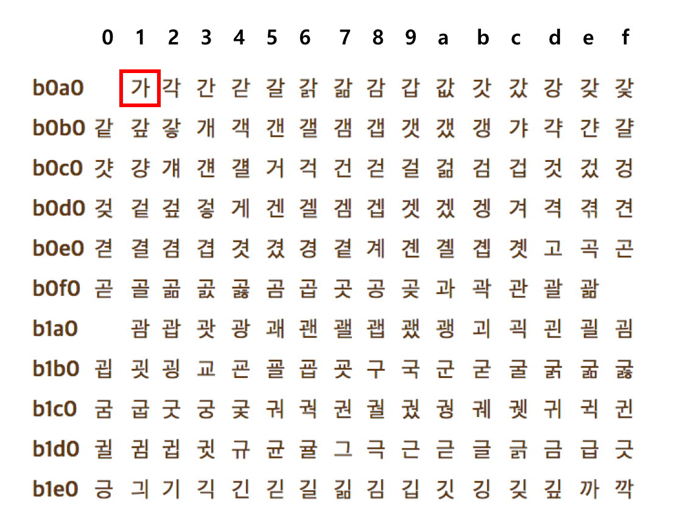

## 0과 1로 문자를 표현하늡 방법
필자는 지금 여러분에게 선보일 책을 집필하기 위해 컴퓨터를켜고 문서 편집기에 문자를 입력하고 있습니다.  
입력하는 문자에는 한글도 있고, 영어도 있고, 특수 문자도 있습니다. 그러면 컴퓨터는 키보드로 입력한 문자들을 실시간으로 모니터에  
띄워 줍니다. 

컴퓨터는 0과 1만 이해할 수 있다고 했는데, 필자가 입력한 문자를 어떻게 이해하고 모니터에 출력하는 걸까요?

이번 절에서는 0과 1로 문자를 표현하는 방법, 즉 컴퓨터가 문자를 이해하고 표현하는 다양한 방법에 대해서 알아보겠습니다.

## 문자 집합과 인코딩
0과 1로 문자를 표현하는 방법에 대해 알아보기 전에 여러분이 반드시 알아야 할 세 가지 용어가 있습니다.  
바로 문자 집합, 인코딩, 디코딩입니다.

컴퓨터가 인식하고 표현할 수 있는 문자의 모음을 **문자 집합**이라고 합니다.  
컴퓨터는 문자 집합에 속해 있는 문자를 이해할 수 있고, 반대로 문자 집합에 속해 있지 않은 문자는 이해할 수 없습니다.  
예를 들어 문자 집합이 {a,b,c,d,e}인 경우 컴퓨터는 이 다섯 개의 문자는 이해할 수 있고, f나 g같은 문자는 이해하지 못합니다.

문자 집합에 속한 문자라고 해서 컴퓨터가 그대로 이해할 수 있는 건 아닙니다. 문자를 0과 1로 변환해야 비로소 컴퓨터가 이해할 수 있습니다.  
이 변환 과정을 **문자 인코딩**이라 하고 인코딩 이후 0과 1로 이루어진 결과값이 문자 코드가 됩니다.  
같은 문자 집합에 대해서도 다양한 인코딩 방법이 있을 수 있습니다.

인코딩의 반대 과정, 즉 0과 1로 이루어진 문자 코드를 이해할 수 있는 문자로 변환하는 과정은 **문자 디코딩**이라고 합니다.

정리하자면 컴퓨터가 인식할 수 있는 문자들의 모음은 문자 집한, 이 문자들을 컴퓨터가 이해할 수 있는 0과 1로 변환하는 과정을 인코딩,  
반대로 0과 1로 표현된 문자 코드를 사람이 읽을 수 있는 문자로 변환하는 과정을 디코딩이라고 합니다.

## 아스키 코드
**아스키 (ASCCI : American Standard Code for information Interechange)**는 초창기 문자 집합중 하나로,  
영어 알파벳과 아라비아 숫자, 그리고 일부 특수 문자를 포함합니다. 아스키 문자 집합에 속한 문자(이하 **아스키 문자**)들은 각각 7비트로 표현되는데,  
7비트로 표현할 수 있는 정보의 가짓수는 $2^7$개로, 총 128개의 문자를 표현할 수 있습니다.

> 실제로 하나의 아스키 문자를 나타내기 위해 8비트(1바이트)를 사용합니다. 하지만 8비트 중 1비트는 패리티 비트(parity bit)라고 불리는,  
> 오류 검출을 위해 사용되는 비트이기 때문에 실질적으로 문자 표현ㅇ르 위해 사용되는 비트는 7비트입니다.

| 십진수 | 십육진수 | 문자 | 십진수 | 십육진수 | 문자 | 십진수 | 십육진수 | 문자 | 십진수 | 십육진수 | 문자 |
|---:|---:|---|---:|---:|---|---:|---:|---|---:|---:|---|
| 0 | 0x00 | NUL | 32 | 0x20 | 공백 | 64 | 0x40 | @ | 96 | 0x60 | ` |
| 1 | 0x01 | SOH | 33 | 0x21 | ! | 65 | 0x41 | A | 97 | 0x61 | a |
| 2 | 0x02 | STX | 34 | 0x22 | " | 66 | 0x42 | B | 98 | 0x62 | b |
| 3 | 0x03 | ETX | 35 | 0x23 | # | 67 | 0x43 | C | 99 | 0x63 | c |
| 4 | 0x04 | EOT | 36 | 0x24 | $ | 68 | 0x44 | D | 100 | 0x64 | d |
| 5 | 0x05 | ENQ | 37 | 0x25 | % | 69 | 0x45 | E | 101 | 0x65 | e |
| 6 | 0x06 | ACK | 38 | 0x26 | & | 70 | 0x46 | F | 102 | 0x66 | f |
| 7 | 0x07 | BEL | 39 | 0x27 | ' | 71 | 0x47 | G | 103 | 0x67 | g |
| 8 | 0x08 | BS | 40 | 0x28 | ( | 72 | 0x48 | H | 104 | 0x68 | h |
| 9 | 0x09 | TAB | 41 | 0x29 | ) | 73 | 0x49 | I | 105 | 0x69 | i |
| 10 | 0x0A | LF | 42 | 0x2A | * | 74 | 0x4A | J | 106 | 0x6A | j |
| 11 | 0x0B | VT | 43 | 0x2B | + | 75 | 0x4B | K | 107 | 0x6B | k |
| 12 | 0x0C | FF | 44 | 0x2C | , | 76 | 0x4C | L | 108 | 0x6C | l |
| 13 | 0x0D | CR | 45 | 0x2D | - | 77 | 0x4D | M | 109 | 0x6D | m |
| 14 | 0x0E | SO | 46 | 0x2E | . | 78 | 0x4E | N | 110 | 0x6E | n |
| 15 | 0x0F | SI | 47 | 0x2F | / | 79 | 0x4F | O | 111 | 0x6F | o |
| 16 | 0x10 | DLE | 48 | 0x30 | 0 | 80 | 0x50 | P | 112 | 0x70 | p |
| 17 | 0x11 | DC1 | 49 | 0x31 | 1 | 81 | 0x51 | Q | 113 | 0x71 | q |
| 18 | 0x12 | DC2 | 50 | 0x32 | 2 | 82 | 0x52 | R | 114 | 0x72 | r |
| 19 | 0x13 | DC3 | 51 | 0x33 | 3 | 83 | 0x53 | S | 115 | 0x73 | s |
| 20 | 0x14 | DC4 | 52 | 0x34 | 4 | 84 | 0x54 | T | 116 | 0x74 | t |
| 21 | 0x15 | NAK | 53 | 0x35 | 5 | 85 | 0x55 | U | 117 | 0x75 | u |
| 22 | 0x16 | SYN | 54 | 0x36 | 6 | 86 | 0x56 | V | 118 | 0x76 | v |
| 23 | 0x17 | ETB | 55 | 0x37 | 7 | 87 | 0x57 | W | 119 | 0x77 | w |
| 24 | 0x18 | CAN | 56 | 0x38 | 8 | 88 | 0x58 | X | 120 | 0x78 | x |
| 25 | 0x19 | EM | 57 | 0x39 | 9 | 89 | 0x59 | Y | 121 | 0x79 | y |
| 26 | 0x1A | SUB | 58 | 0x3A | : | 90 | 0x5A | Z | 122 | 0x7A | z |
| 27 | 0x1B | ESC | 59 | 0x3B | ; | 91 | 0x5B | [ | 123 | 0x7B | { |
| 28 | 0x1C | FS | 60 | 0x3C | < | 92 | 0x5C | \ | 124 | 0x7C | \| |
| 29 | 0x1D | GS | 61 | 0x3D | = | 93 | 0x5D | ] | 125 | 0x7D | } |
| 30 | 0x1E | RS | 62 | 0x3E | > | 94 | 0x5E | ^ | 126 | 0x7E | ~ |
| 31 | 0x1F | US | 63 | 0x3F | ? | 95 | 0x5F | _ | 127 | 0x7F | DEL |

앞의 표는 아스키 코드표입니다. 표를 보면 알 수 있듯 아스키 문자들은 0부터 127까지 총 128개의 숫자 중 하나의 고유한 수에 일대일로 대응합니다.  
아스키 문자에 대응된 고유한 수를 **아스키 코드**라고 합니다. 우리는 아스키 코드를 이진수로 표현함으로써 아스키 문자를 0과 1로 표현할 수 있습니다.  
아스키 문자는 이렇게 아스키 코드로 인코딩됩니다.

예를 들어 'A'는 십진수 65(이진수 10000001(2))로 인코딩되고, 'a'는 97 (이진수 1100001(2))로, 특수 문자 !는 33(이진수 100001(2))으로  
인코딩됩니다. 간단하죠? 참고로 아스키 코드표를 보면 Baqckspace, Escape, Cancel, Space와 같은 제어 문자도 아스키 코드에 포함되어 있다는 것을  
알 수 있습니다.

> 문자 인코딩에서 '글자에 부여된 고유한 값'을 **코드 포인트(code point)**라고 합니다. 가령 아스키 문자 A 코드 포인트는 65입니다.  
> 다만 이 책에서는 쉬운 설명을 위해 코드 포인트라는 용어 대신에 문자에 부여된 값, 문자에 부여된 코드라는 용어로 설명하겠습니다.

이렇듯 아스키 코드는 매우 간단하게 인코딩된다는 장점이 있지만, 단점도 있습니다. 다들 짐작하겠지만 한글을 표현할 수 없습니다.  
한글뿐만 아니라 아스키 문자 집합 외의 문자, 특수문자도 표현할 수 없습니다. 근본적으로 아스키 문자 집합에 속한 문자들은 7비트로 표현하기에  
128개보다 많은 문자를 표현하지 못하기 때문입니다. 

훗날 더 다양한 문자 표현을 위해 아스키 코드에 1비트를 추가한 8비트 **확장 아스키**가 등장하기도 했지만, 그럼에도 표현 가능한 문자의 수는  
256개여서 턱없이 부족했습니다.

그래서 한국을 포함한 영어권 외의 나라들은 자신들의 언어를 0과 1로 표현할 수 있는 고유한 문자 집합과 인코딩 방식이 필요하다고 생각했습니다.  
이런 이유로 다양한 한글 인코딩 방식이 바로 EUC-KR입니다.

## EUC-KR
한글 인코딩을 이해하려면 우선 한글의 특수성을 알아야 합니다. 알파벳을 쭉 이어 쓰면 단어가 되는 영어와는 달리, 한글은 각 음절 하나하나가  
초성, 중성, 종성의 조합으로 이루어져 있습니다. 그래서 한글 인코딩에는 두 가지 방식, 완성형(한글 완성형 인코딩)과 조합형(한글 조합형 인코딩)이 존재합니다.

한글 인코딩에는 두 가지 방식, 완성형(한글 완성형 인코딩)과 조합형(한글 조합형 인코딩)이 존재합니다.

**완성형 인코딩** 방식은 초성, 중성, 종성의 조합으로 이루어진 완성된 하나의 글자에 고유한 코드를 부여하는 인코딩 방식입니다.  
예를 들어 '가'는 1, '나'는 2 '다'는 3, 이런 식으로 인코딩하는 방식이죠.

반명 **조합형 인코딩** 방식은 초성을 위한 비트열, 중성을 위한 비트열, 종성을 위한 비트열을 할당하여 그것들의 조합으로 하나의 글자  
코드를 완성하는 인코딩 방식입니다. 다시 말해 초성, 중성, 종성에 해당하는 코드를 합하여 하나의 글자 코드를 만드는 인코딩 방식입니다.

**EUC-KR**은 KS X 1001, KS X 1003이라는 문자 집합을 기반으로 하는 대표적인 완성형 인코딩 방식입니다.  
즉, EUC-KR 인코딩은 초성, 중성, 종성이 모두 결합된 한글 단어에 2바이트 크기의 코드를 부여합니다.

한글 한 글자에 2 바이트 코드가 부여된다고 했죠? 다시 말해 EUC-KR로 인코딩된 한글 한 글자를 표현하려면 16바이트가 필요합니다.  
그리고 16비트는 네 자리 십육진수로 표현할 수 있습니다. 즉 EUC-KR로 인코딩된 한글은 네 자리 십육진수로 나타낼 수 있습니다.



EUC-KR 인코딩 방식으로 총 2,350개 정도의 한글 단어를 표현할 수 있습니다. 아스키 코드보다 표현할 수 있는 문자가 많아졌지만,  
사실 이는 모든 한글 조합을 표현할 수 있을 정도로 많은 양은 아닙니다. 그래서 문자 집합에 정의되지 않은 '뷁', '뷇', '믜' 같은  
글자는 EUC-KR로 표현할 수 없습니다.

모든 한글을 표현할 수 없다는 사실은 때때로 크고 작은 문제를 유발합니다. EUC-KR 인코딩을 사용하는 웹사이트의 한글이 깨진다든지,  
EUC-KR 방식으로는 표현할 수 없는 이름으로 인해 은행, 학교 등에서 피해를 받는 사람이 생겨나기도 했습니다.

이러한 문제를 조금이나마 해결하기 위해 등자한 것이 마이크로소프트의 CP949입니다.  
CP949는 EUC-KR의 확장된 버전으로, EUC-KR로는 표현할 수 없는 더욱 다양한 문자를 표현할 수 있습니다.  
다만, 이마저도 한글 전체를 표현하기에 넉넉한 양은 아닙니다.

## 유니코드와 UTF-8

EUC-KR 인코딩 덕분에 한국어를 컴퓨터에서 표현할 수 있게 되었습니다.
하지만 EUC-KR은 모든 한글을 표현할 수 없다는 한계가 있었습니다.

또한 언어마다 서로 다른 문자 집합과 인코딩 방식을 사용한다면, 다국어를 지원하는 프로그램을 만들 때 각 나라의 인코딩 방식을 모두 고려해야 하는 번거로움이 생깁니다.

예를 들어 한국어, 영어, 일본어, 중국어, 독일어를 지원하는 웹사이트가 있다고 해보겠습니다.
이 웹사이트가 언어마다 서로 다른 인코딩 방식을 사용해야 한다면, 개발자는 각 언어의 문자 표현 방식과 인코딩 규칙을 모두 신경 써야 합니다.

이런 문제를 해결하기 위해 등장한 것이 **유니코드**입니다.

유니코드는 전 세계의 문자를 하나의 체계 안에서 표현하기 위한 **표준 문자 집합**입니다.
한글뿐만 아니라 영어, 일본어, 중국어, 특수문자, 화살표, 이모지까지도 유니코드 안에서 표현할 수 있습니다.

예를 들어 유니코드에서는 문자마다 고유한 코드값을 부여합니다.

```text
A  → U+0041
가 → U+AC00
😀 → U+1F600
```

여기서 `U+0041`, `U+AC00`과 같은 값은 유니코드에서 문자를 구분하기 위해 정한 **코드 포인트**입니다.

하지만 여기서 중요한 점이 있습니다.
유니코드는 문자에 고유한 번호를 부여하는 표준이지, 그 번호를 컴퓨터에 실제로 어떻게 저장할지까지 하나로 고정한 방식은 아닙니다.

컴퓨터는 결국 모든 데이터를 바이트 단위로 저장합니다.
따라서 유니코드 코드 포인트를 실제 파일이나 메모리에 저장하려면, 이 값을 바이트로 바꾸는 규칙이 필요합니다.

이때 사용하는 방식이 **UTF-8**입니다.

UTF-8은 유니코드 문자를 실제 바이트로 변환하는 **문자 인코딩 방식**입니다.
즉, 유니코드가 “이 문자는 어떤 번호를 가진다”를 정한다면, UTF-8은 “그 번호를 어떤 바이트로 저장할 것인가”를 정합니다.

```text
문자 → 유니코드 코드 포인트 → UTF-8 바이트
```

예를 들어 한글 `가`는 유니코드에서 `U+AC00`이라는 코드 포인트를 가집니다.
그리고 이 값을 UTF-8로 인코딩하면 다음과 같은 바이트 값이 됩니다.

```text
가 → U+AC00 → EA B0 80
```

영어 `A`는 다음과 같습니다.

```text
A → U+0041 → 41
```

UTF-8의 특징은 문자에 따라 사용하는 바이트 수가 달라진다는 점입니다.
영어 알파벳이나 숫자처럼 ASCII와 겹치는 문자는 1바이트로 표현하고, 한글은 보통 3바이트로 표현합니다.

```text
A  → 1바이트
가 → 3바이트
😀 → 4바이트
```

즉, EUC-KR은 특정 문자 집합의 문자들을 정해진 방식으로 인코딩하는 방식이었다면, 유니코드는 전 세계 문자를 하나의 문자 집합으로 모아 두고, UTF-8은 그 유니코드 문자를 실제 바이트로 저장하는 대표적인 인코딩 방식이라고 볼 수 있습니다.

정리하면 다음과 같습니다.

```text
유니코드 = 전 세계 문자를 숫자로 정의한 표준 문자 집합
UTF-8   = 유니코드 코드값을 바이트로 저장하는 인코딩 방식
```

따라서 현대 웹과 대부분의 프로그램에서는 다양한 언어를 하나의 방식으로 처리하기 위해 **유니코드와 UTF-8**을 함께 사용합니다.


