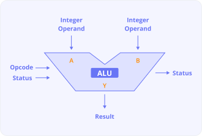
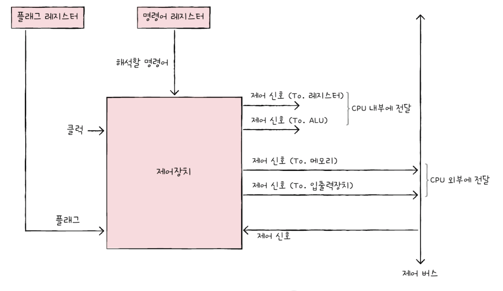

## ALU와 제어장치

챕터 1의 기억을 되살려 봅시다. CPU는 메모리에 저장된 명령어를 읽어 들이고, 해석하고, 실행하는 장치라고 했습니다.  
그리고 CPU 내부에는 계산을 담당하는 ALU, 명령어를 읽어 들이고 해석하는 제어장치, 작은 임시 저장 장치인 레지스터라는 구성 요소가 있다고 했습니다. 

이번 절에서는 ALU와 제어장치를 학습해 보겠습니다.
참고로, 이 책은 ALU나 제어장치를 구성하는 회로나 구현 방법은 다루지 않습니다. ALU와 제어장치가 받아들이고 내보내는  
정보를 기준으로 각 부품의 역할을 설명할 테니, 여러분들도 ALU와 제어장치가 무엇을 내보내고, 무엇을 받아들이지는지 집중해서 읽어 주세요.

## ALU

아래 그림은 ALU가 어떤 정보를 받아들이고 내보내는지를 표현한 그림입니다.

우선 ALU가 받아들이는 정보부터 보겠습니다.

ALU는 계산하는 부품이라고 했었습니다. 계산을 하기 위해 무엇이 필요할까요? 1+2를 계산할 때 1과 2라는 피연산자와 더하기라는 수행할  
연산이 필요하듯 ALU가 계산을 하기 위해서는 피연산자와 수행할 연산이 필요합니다.

그래서 **ALU**는 레지스터를 통해 **피연산자**를 받아들이고, 제어장치로부터 수행할 연산을 알려주는 **제어 신호**를 받아들입니다.  
ALU는 레지스터와 제어장치로부터 받아들인 피연산자와 제어 신호로 산술 연산, 논리 연산 등 다양한 연산을 수행합니다.

이번에는 ALU가 내보내는 정보를 알아보겠습니다.

연산을 수행한 결과는 특정 숫자나 문자가 될 수 있고, 메모리 주소가 될 수도 있습니다.  
그리고 이 결괏값은 바로 메모리에 저장되지 않고 일시적으로 레지스터에 저장됩니다.

CPU가 메모리에 접근하는 속도는 레지스터에 접근하는 속도보다 훨씬 느립니다. ALU가 연산할 때마다 결과를 메모리에 저장한다면  
당연하게도 CPU는 메모리에 자주 접근하게 되고, 이는 CPU가 프로그램 실행 속도를 늦출 수 있습니다.  
그래서 ALU의 결괏값을 메모리가 아닌 레지스터에 우선 저장하는 겁니다.

이전 페이지의 그림을 보면 계산 결괏값 외에 ALU가 내보내는 또 다른 정보가 있었습니다.  
ALU는 계산 결과와 더불어 **플래그**를 내보냅니다. 이 플래그는 여러분들이 이번 절에서 알아야할 중요한 키워드입니다.

플래그는 챕터 2에서 이미 본적이 있습니다. "이진수만 봐서는 음수인지 양수인지 판단하기 어렵기 때문에 음수와 양수를 구분하기 위해  
플래그를 사용한다"라고 했었습니다. 이처럼 때때로 ALU는 결괏값뿐만 아니라 연산 결과에 대한 추가적인 정보를 내보내야 할 때가 있습니다.  
가령 연산 결과각 음수일 때 ALU는 '방금 계산한 결과는 음수'라는 추가 정보를 내보냅니다. 혹은 연산 결과가 연산 결과를 담을 레지스터보다  
클 때 ALU는 '결괏값이 너무 크다'라는 추가 정보를 내보냅니다.

> 연산 결과가 연산 결과를 담을 레지스터보다 큰 상황을 오버플로우라고 합니다.

이러한 연산 결과에 대한 추가적인 상태 정보를 **플래그**라고 합니다. ALU가 내보내는 대표적인 플래그는 아래와 같습니다. 

| 플래그 종류 | 의미 | 사용 예시 | 
| --------- | --------------- | --------------- |
| 부호 플래그 | 연산한 결과의 부호를 나타냅니다. | 부호 플래그가 1일 경우 계산 결과는 음수, 0일 경우 계산 결과는 양수를 의미합니다. | 
| 제로 플래그 | 연산 결과가 0인지 여부를 나타냅니다. | 제로 플래그가 1일 경우 연산 결과는 0, 0일 경우 연산 결과는 0이 아님을 의미합니다. | 
| 캐리 플래그 | 연산 결과 올림수나 빌림수가 발생하는지를 나타냅니다. | 캐리 플래그가 1일 경우 올림수나 빌림수가 발생했음을 의미하고, 0일 경우 발생하지 않았음을 의미합니다. |
| 오버플로우 플래그 | 오퍼플로우가 발생했는지를 나타냅니다. | 오버플로우 플래그가 1일 경우 오버플로우가 발생했음을 의미하고, 0일 경우 발생하지 않았음을 의미합니다. | 
| 인터럽트 플래그 | 인터럽트가 가능한지를 나타냅니다. | 인터럽트 플래그가 1일 경우 인터럽트가 가능함을 의미하고, 0일 경우 인터럽트가 불가능함을 의미합니다. | 
| 슈퍼바이저 플래그 | 커널 모드로 실행 중인지, 사용자 모드로 실행 중인지를 나타냅니다. | 슈퍼바이저 플래그가 1일 경우 커널 모드로  실행 중임을 의미하고, 0일 경우 사용자 모드로 실행 중임을 의미합니다. | 

이러한 플래그는 CPU가 실행하는 도중 반드시 기억해야 되는 일종의 참고 정보입니다. 그리고 플래그들은 **플래그 레지스터**라는 레지스터에 저장됩니다.  
플래그 레지스터는 이름 그대로 플래그 값들을 저장하는 레지스터입니다. 이 레지스터를 읽으면 연산 결과에 추가적인 정보, 참고 정보를 얻을 수 있습니다.

예를 들어 플래그 레지스터가 아래와 같은 구조를 가지고 있고, ALU가 연산을 수행한 직후 **부호 플래그**가 1이 되었다면 연산 결과는 음수임을 알 수 있습니다.

또한 만약 ALU가 연산을 수행한 직후 플래그 레지스터가 아래와 같다면 제로 플래그가 1이 되었으니 연산 결과는 0임을 알 수 있습니다. 

이 밖에도 ALU 내부에는 여러 계산을 위한 회로들이 있습니다. 대표적으로 덧셈을 위한 가산기, 뺄셈을 위한 보수기, 시프트 연산을 수행하는 시프터,  
오버플로우 검출기 등이 있습니다. 

## 제어장치

이번에는 제어장치에 대해 알아보겠습니다. **제어장치**는 제어 신호를 내보내고, 명령어를 해석하는 부품이라고 설명했습니다.  그리고 **제어 신호**는  
컴퓨터 부품들을 관리하고 작동시키기 위한 일종의 전기 신호라고 했습니다.

참고로, 제어장치는 CPU의 구성 요소 중 가장 정교하게 설계된 부팜이라고 해도 과언이 아닙니다.  
그래서 CPU 제조사마다 제어장치의 구현 방식이나 명령어를 해석하는 방식, 받아들이고 내보내는 정보에는 조금씩 차이가 있습니다. 

이 책에서는 제어장치가 받아들이고 내보내는 가장 대표적인 정보에만 초점을 맞춰 설명할 테니, 여러분들은 다음 내용을 모두 외우려고 하지 말고  
제어장치의 역할을 이해하는 데만 초점을 맞춰 읽어보세요.

그럼 제어장치가 무엇을 받아들이고, 무엇을 내보내는지 다음 그림을 보며 하나씩 살펴보겠습니다. 

제어장치가 받아들이는 정보부터 알아보겠습니다. 

### 첫째, 제어장치는 클럭 신호를 받아들입니다.
**클럭**이란 컴퓨터의 모든 부품을 일사불란하게 움직일 수 있게 하는 시간 단위입니다. 클럭의 "똑-딱-똑-딱" 주기에 맞춰 한 레지스터에서  
다른 레지스터로 데이터가 이동되거나, ALU에서 연산이 수행되거나, CPU가 메모리에 저장된 명령어를 읽어 들이는 것입니다.

다만, "컴퓨터는 모든 부품이 클럭 신호에 맞춰 동작한다"라는 말은 "컴퓨터의 모든 부품이 한 클럭마다 동작한다"라고 이해하면 안 됩니다.  
컴퓨터 부품들은 컬럭이라는 박자에 맞춰 작동할 뿐 한 박자 마다 작동하는 것은 아닙니다. 

### 둘째, 제어장치는 '해석해야 할 명령어'를 받아들입니다.

다음 절에서 배우겠지만, CPU가 해석해야 할 명령어는 **명령어 레지스터**라는 특별한 레지스터에 저장됩니다.  
제어장치는 이 명령어 레지스터로부터 해석할 명령어를 받아들이고 해석한 뒤, 제어 신호를 발생시켜 컴퓨터 부품들에 수행해야 할 내용을 알려줍니다.

### 셋째, 제어장치는 플래그 레지스터 속 플래그 값을 받아들입니다.

플래그는 ALU 연산에 대한 추가적인 상태 정보라고 했습니다. 제어장치가 제어 신호를 통해 컴퓨터 부품들을 제어할 때 이 중요한 참고  
사항을 무시하면 안 됩니다. 그렇기에 제어장치는 플래그 값을 받아들이고 이를 참고하여 제어 신호를 발생시킵니다.

### 넷째, 제어장치는 시스텀 버스, 긎 우에서 제어 버스로 전달된 제어 신호를 받아들입니다.

제어 신호는 CPU 뿐만 아니라 입출력장치를 비롯한 CPU 외부 장치도 발생시킬 수 있습니다. 제어장치는 제어 버스를 통해  
외부로부터 전달된 제어 신호를 받아들이기도 합니다.

이제 제어장치가 내보내는 정보를 알아봅시다. 여기에는 CPU 외부에 전달되는 제어 신호와 CPU 내부에 전달되는 제어 신호가 있습니다. 

제어장치가 CPU 외부에 제어 신호를 전달한다는 말은 곧, 제어 버스로 제어 신호를 내보낸다는 말과 같습니다.  
이러한 제어 신호에는 크게 메모리에 전달하는 제어 신호와 입출력장치에 전달하는 제어 신호가 있습니다.

제어장치가 메모리에 저장된 값을 읽거나 메모리에 새로운 값을 쓰고 싶다면 메모리로 제어 신호를 내보냅니다.  
그리고 제어장치가 입출력장치의 값을 읽거나 입출력장치에 새로운 값을 쓰고 싶을 때는 입출력장치로 제어 신호를 내보냅니다.

제어장치가 CPU 내부에 전달하는 제어 신호에는 크게 ALU에 전달하는 제어 신호와 레지스터에 전달하는 제어 신호가 있습니다.  
ALU에는 수행할 연산을 지시하기 위해, 레지스터에는 레지스터 간에 데이터를 이동시키거나 레지스터에 저장된 명령어를 해석하기 위해 제어 신호를 내보냅니다.