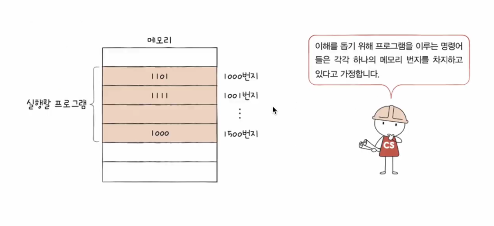
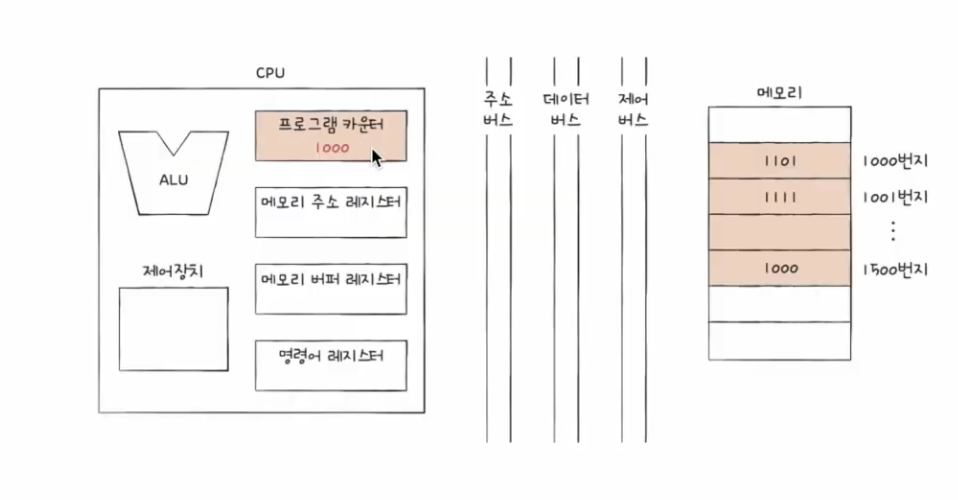
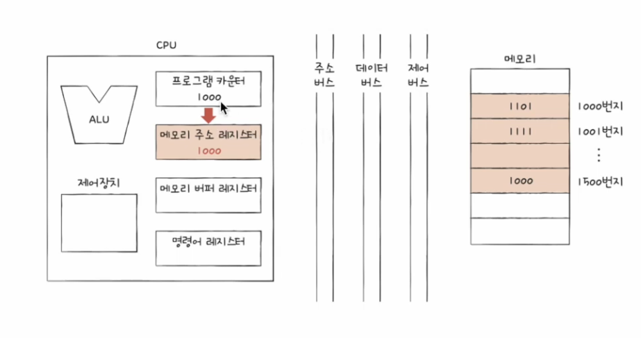
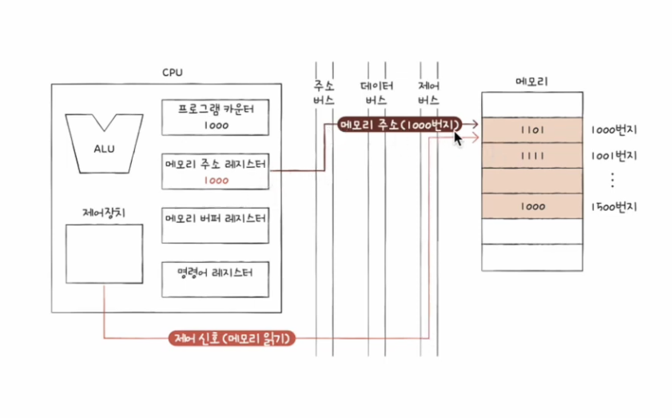
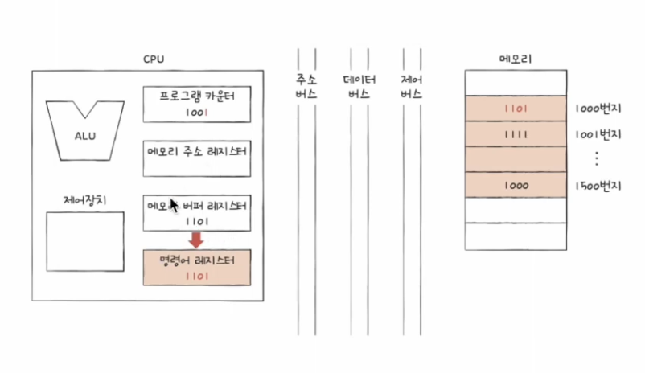
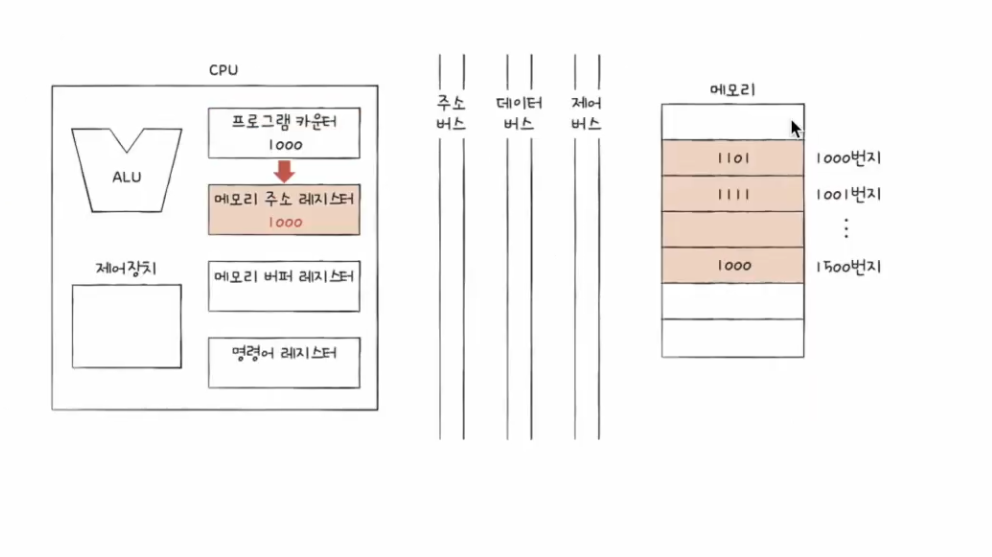
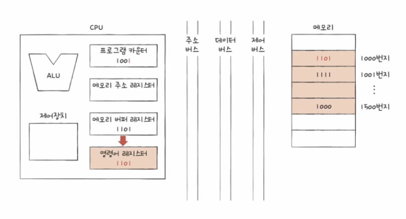
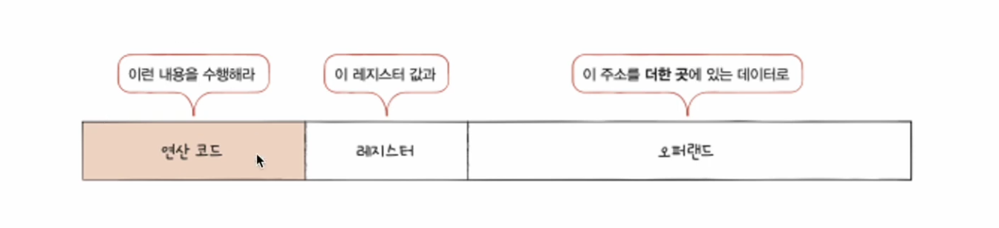

## 레지스터
프로그램 속 명령어와 데이터는 실행 전후로 반드시 레지스터에 저장됩니다. 따라서 레지스터에 저장된 값만 잘 관찰해도  
프로그램의 실행 흐름을 파악할 수 있습니다. 다시 말해 레지스터 속 값을 유심히 관찰하면 프로그램을 실행 때 CPU 내에서 무슨 일이  
벌어지고 있는지, 어떤 명령어가 어떻게 수행되는지 알 수 있습니다.

CPU 안에는 다양한 레지스터들이 있고, 각기 다른 역할을 가지고 있습니다.

## 반드시 알아야 할 레지스터
상용화된 CPU 속 레지스터들을 CPU마다 이름, 크기, 종류가 매우 다양합니다.  
이들은 각 CPU 제조사 홈페이지나 공식 문서 등에서 확인할 수 있습니다. 모든 레지스터를 이 책에서 전부 다룰 수는 없기에  
이번 절에서는 여러 전공 서적에서 중요하게 다루는 레지스터, 많은 CPU가 공통으로 포함하고 있는 여덟 개의 레지스터를 학습해 보겠습니다.

여러분이 알아야 할 여덟 개의 레지스터는 아래와 같습니다. 이 레지스터들은 저마다의 역할이 있고, 그에 걸맞는 내용을 저장합니다.  
당장은 종류가 많아 보이고 모두 외워야 할 것 같은 부담이 느껴질 수 있지만, 각 레지스터가 CPU 내부에서 어떤 역할을 수행하는지에 유의하며 읽다  
보면 암기할 필요가 없다는 걸 알게 됩니다.

1. 프로그램 카운터
2. 명령어 레지스터
3. 메모리 주소 레지스터
4. 메모리 버퍼 레지스터
5. 플래그 레지스터
6. 범용 레지스터
7. 스택 포인터
8. 베이스 레지스터

우선 첫 번째 프로그램 카운터부터 네 번째 메모리 버퍼 레지스터까지, 네 개의 레지스터를 살펴보겠습니다.

### 프로그램 카운터
**프로그램 카운터**는 메모리에서 가져올 명령어의 주소, 즉 메모리에서 읽어 들일 명령어의 주소를 저장합니다.  
프로그램 카운터를 **명령어 포인터**라고 부르는 CPU도 있습니다.

### 명령어 레지스터
**명령어 레지스터**는 해석할 명령어, 즉 방금 메모리에서 읽어 들인 명령어를 저장하는 레지스터입니다.  
제어장치는 명령어 레지스터 속 명령어를 받아들이고 이를 해석하 ㄴ뒤 제어 신호를 내보냅니다.

### 메모리 주소 레지스터
**메모리 주소 레지스터**는 메모리의 주소를 저장하는 레지스터입니다. CPU가 읽어 들이고자 하는 주소 값을 주소 버스로  
보낼 때 메모리 주소 레지스터를 거치게 됩니다. 

### 메모리 버퍼 레지스터
**메모리 버퍼 레지스터**는 메모리와 주고받을 값(데이터와 명령어)을 저장하는 레지스터입니다.  
즉, 메모리에 쓰고 싶은 값이나 메모리로부터 전달받은 값은 메모리 버퍼 레지스터를 거칩니다. CPU가 주소 버스로 내보낼 값이  
메모리 주소 레지스터를 거친다면, 데이터 버스로 주고받을 값을 메모리 버퍼 레지스터를 거칩니다.

> 메모리 버퍼 레지스터는 **메모리 데이터 레지스터**(MDR : Memory Data Register)라고도 부릅니다.

아직은 앞의 레지스터들이 정확히 어떻게 작동하는지 감이 잘 잡히지 않을 수 있습니다. 그렇다면 메모리에 저장된 프로그램을 실행하는 과정에서  
프로그램 카운터, 명령어 레지스터, 메모리 주소 레지스터, 메모리 버퍼 레지스터에 어떤 값들이 담기는지 알아보겠습니다.

1. CPU로 실행할 프로그램이 1000번지부터 1500번지까지 저장되어 있다고 가정하겠습니다. 고리고 1000번지에느 1101(2)이 저장되어 있다고 가정해보겠습니다.

    

2. 프로그램을 처음부터 실행하기 위해 프로그램 카운터에는 1000이 저장됩니다. 이는 메모리에서 가져올 명령어가 1000번지에 있다는 것을 의미합니다.

    

3. 1000번지를 읽어 들이기 위해서는 주소 버스로 1000번지를 내보내야 합니다. 이를 위해 메모리 주소 레지스터에는 1000이 저장됩니다.

    

4. '메모리 읽기' 제어 신호와 메모리 주소 레지스터 값이 각각 제어 버스와 주소 버스를 통해 메모리로 보내집니다.

    

5. 메모리 1000번지에 저장된 값을 데이터 버스를 통해 메모리 버퍼 레지스터로 전달되고, 프로그램 카운터는 증가되어 다음 명령어를 읽어 들일 준비를 합니다.

    

6. 메모리 버퍼 레지스터에 저장된 값을 명령어 레지스터로 이동합니다.

    

7. 제어장치는 명령어 레지스터의 명령어를 해석하고 제어 신호를 발생시킵니다.

    

5단계에서 프로그램 카운터 값이 증가한 것을 확인했습니다. 프로그램 카운터 값이 증가했으니 1000번지 명령어 처리가 끝나면 CPU는 다음 명령어(1001 번지)를  
읽어 들입니다.

이처럼 프로그램 카운터는 지속적으로 증가하며 계속해서 다음 명령어를 읽어 들일 준비를 합니다. 이 과정이 반복되면서 CPU는 프로그램을 차례대로 실행해 나갑니다.  
결국 CPU가 메모리 속 프로그램을 순차적으로 읽어 들이고 실행해 나갈 수 있는 이유는 CPU속 프로그램 카운터가 꾸준히 증가하기 때문입니다.

> **순차적인 실행 흐름이 끊기는 이유**
> 일반적으로 프로그램 카운터는 꾸준히 증가하며 프로그램을 차례대로 실행합니다. 하지만 종종 프로그램 카운터가 실행 중  
> 인 명령어의 다음 번지 주소가 아닌 전혀 다른 값으로 업데이트되는 경우가 있습니다. 이런 상황이라면 프로그램이 차례대로 실행되지 않습니다.  
> 이런 상황은 언제 발생할까요? 
> 
> 명령어 중 JUMP, CONDIONAL JUMP, CALL, RET와 같이 특정 메모리 주소로 실행 흐름을 이동하는 명령어가 실행되었을 때 프로그램은  
> 차례대로 실행되지 않습니다. 이런 경우 프로그램 카운터에는 변경된 주소가 저장됩니다.
>
> 가령 120번지를 실행하는 도중 JUMP 2500이라는 명령어를 만났다고 가정해 보겠습니다. 이 명령어는 "2500번지로 점프하라", "2550번지 부터  
> 실행하라"라는 명령어입니다. 이 명령어를 실행한 다음에는 1201번지가 아닌 2500번지를 실행해야 하기 때문에 프로그램 카운터에는 1201번지가  
> 아닌 2500번지가 저장됩니다.
>  
> 또한 인터럽트가 발생해도 프로그램의 순차적인 실행 흐름이 끊어집니다. 

### 범용 레지스터
**범용 레지스터**는 이름 그대로 다양하고 일반적인 상황에서 자유롭게 사용할 수 있는 레지스터입니다. 메모리 버퍼 레지스터는 데이터 버스로  
주고받을 값만 저장하고, 메모리 주소 레지스터는 주소 버스로 내보낼 주소값만 저장하지만, 범용 레지스터는 데이터와 주소를 모두 저장할 수 있습니다.  

일반적으로 CPU 안에는 여러 개의 범용 레지스터들이 있고, 현대 대다수 CPU는 모두 범용 레지스터를 가지고 있습니다.

### 플래그 레지스터
플래그 레지스터는 04-1절에서 정리 한 적이있습니다. ALU 연산 결과에 따른 플래그 플래그 레지스터 저장한다고 했었습니다.  
**플래그 레지스터**는 연산 결과 또는 CPU 상태에 대한 부가적인 정보를 저장하는 레지스터입니다.

## 특정 레지스터를 이용한 주소 지정 방식 : 스택 주소 지정 방식
3장을 마무리하며 "레지스터에 대해 더 공부해야만 이해할 수 있는 주소 지정 방식이 있다"라고 말 했던 것을 기억하시나요?  
지금 바로 3장에서 미처 설명하지 못한 주소 지정 방식을 설명할 때입니다.

앞서 설명한 프로그램 카운터, 그리고 아직 설명하지 않은 스택 포인터, 베이스 레지스터는 주소 지정에 사용될 수 있는 특별한 레지스터입니다.  
**스택 포인터**는 스택 주소 지정 방식이라는 주소 지정 방식에 사용되고, 프로그램 카운터와 베이스 레지스터는 변위 주소 지정 방식이라는 주소 지정  
방식에 사용됩니다. 먼저 스택 주소 지정 방식에 대해 알아보겠습니다.

**스택 주소 지정 방식**은 스택과 스택 포인터를 이용한 주소 지정 방식입니다. 스택은 한쪽 끝이 막혀 있는 통과 같은 공간입니다.  
그래서 스택은 가장 최근에 저장하는 값부터 꺼낼 수 있습니다. 

여기서 **스택 포인터**란 스택의 꼭대기를 가리키는 레지스터입니다.  
즉, 스택 포인터는 스택에 마지막으로 저장한 값의 위치를 저장하는 레지스터입니다.

예를 들어 보겠습니다. 가령 다음과 같이 위에서부터 주소가 매겨져 있고 아래부터 차곡차곡 데이터가 저장되어 있는 스택이 있다고 가정해 보겠습니다.  
이때 스택 포인터는 스택의 제일 꼭대기 주소, 즉 4번지를 저장하고 있습니다. 이는 '스택 포인터가 스택의 꼭데기를 가리키고 있다'고 볼 수 있습니다.  
쉽게 말해, 스택 포인터는 스택의 ㄷ어디까지 데이터가 채워져 있는지에 대한 표시라고 보면 됩니다.

그럼 이 스택에서 데이터를 꺼낼 때는 어떤 데이터부터 꺼내게 될까요?
1 -> 2 -> 3 순서대로 데이터를 꺼낼 수 있겠죠. 여기서 하나의 데이터를 꺼내면 스택에는 2와 3이 남고, 스택의 꼭대기 주소가  
달라졌기 때문에 스택 포인터는 5번지를 가리킵니다.,

반대로 스택에 데이터를 추가한다면 어떻게 될까요? 현재 스택에 4라는 데이터를 저장하면 스택의 꼭대기에 4가 저장됩니다.  
이때 스택의 꼭대기 주소가 달라졌기 때문에 스택 포인터는 4번지를 가리킵니다.

그런데 스택이라는 것은 도대체 어디에 있는 걸까요? 스택은 메모리 안에 있습니다. 정확히는 메모리 안에 스택처럼 사용할 영역이  
정해져 있습니다. 이를 **스택 영역**이라고 합니다. 이 영역은 다른 주소 공간과는 다르게 스택처럼 사용하기로 암묵적으로 약속된 영역입니다.

## 특정 레지스터를 이용한 주소 지정 방식 : 변위 주소 지정 방식

3장에서 명령어는 연산 코드와 오퍼랜드로 이루어져 있다고 언급한 적이 있었습니다. 그리고 오퍼랜드 필드에는 메모리 주소가 담길 때도 있다고 했었습니다.  
**변위 주소 지정 방식**이란 오퍼랜드 필드의 값(변위)과 특정 레지스터의 값을 더하여 유효 주소를 얻어내는 주소 지정 방식입니다.

그래서 변위 주소 지정 방식을 사용하는 명령어는 다음 그림과 같이 연산 코드 필드, 어떤 레지스터의 값과 더할지를 나타내는 레지스터 필드  
그리고 주소를 담고 있는 오퍼랜드 필드가 있습니다.

이때, 변위 지정 방식은 오퍼랜드 필드의 주소와 어떤 레지스터를 더하는지에 따라 **상대 주소 지정 방식**, **베이스 레지스터 주소 지정 방식** 등으로  
나뉩니다. 변위 주소 지정 방식에는 CPU의 종류에 따라 다양한 방식들이 있지만, 이 책에서는 대표적인 상대 주소 지정 방식과 베이스 레지스터 주소 지정 방식을  
다루겠습니다.

### 상대 주소 지정 방식
**상대 주소 지정 방식**은 오퍼랜드와 프로그램 카운터의 값을 더하여 유효 주소를 얻는 방식입니다.

프로그램 카운터는 읽어 들일 명령어의 주소가 저장되어 있습니다. 만약 오퍼랜드가 음수, 가령 -3 이었다면, CPU는 읽어 들이기로 한 명령어로부터  
'세 번쨰 이전'번지로 접근합니다. 한마디로 실행하려는 명령어의 세 칸 이전 번지 명령어를 실행하는 것입니다.

반면 오퍼랜드가 양수, 가령 3이었다면 CPU는 읽어 들이기로 했던 명령어의 '세 번째 이후' 번지로 접근합니다.  
즉, 실행하려는 명령어에서 세 칸 건너뛴 번지를 실행하는 겁니다.

상대 주소 지정 방식은 프로그래밍 언어의 if문과 유사하게 모든 코드를 실행하는 것이 아닌, 분기하여 특정 주소의 코드를 실행할 때 사용됩니다.

### 베이스 레지스터 주소 지정 방식
**베이스 레지스터 주소 지정 방식**은 오퍼랜드 베이스 레지스터의 값을 더하여 유효 주소를 얻는 방식입니다.  

여기서 베이스 레지스터는 '기준 주소', 오퍼랜드는 '기준 주소로부터 떨어진 거리'로서의 역할을 합니다.  
즉, 베이스 레지스터 주소 지정 방식은 베이스 레지스터 속 기준 주소로부터 얼마나 떨어져 있는 주소에 접근할 것인지를 연산하여 유효 주소를  
얻어내는 방식입니다.

가령 베이스 레지스터에 200이라는 값이 있고 오퍼랜드가 40이라면 이는 "기준 주소 200번지로부터 40만큼 떨어진 240번지로 접근하라"를 의미합니다.  
또 베이스 레지스터에 550이라는 값이 담겨 있고 오퍼랜드가 50이라면 이는 "기준 주소 550번지로부터 50만큼 떨어진 600번지로 접근하라"를 의미하는 명령어입니다.

## 상용화된 CPU 속 레지스터 및 주소 지정 방식
이로써 CPU를 구성하는 ALU, 제어장치, 레지스터를 모두 학습했습니다. 끝으로 덧붙여 말하면, 이쯤에서 여러분은 선택을 해야 합니다.  
지금까지 설명을 잘 따라왔다면 여러분들은 CPU의 기본적인 원리를 이해한 것이고, 앞으로도 CPU의 기본적인 작동법을 팍악하는 데 큰 지장이 없습니다.

따라서 CPU의 큰 그림만 그려보고 싶었던 독자들은 바로 다음 절로 넘어가도 좋습니다.

하지만 만약 여러분들이 실제 CPU의 작동법을 자세히 관찰해야 하는 개발자, 이를테면 임베디드 개발자, 게임 엔진 개발자, 보안 솔루션 개발자,  
시스템 해커 등을 지망한다면 아직 하나의 단계가 더 남아 있습니다.

사실, CPU는 여러분들이 학습할 컴퓨터 부품 중 전공서 속의 모습과 실제 모습이 가장 다른 부품이라고 해도 과언이 아닐 만큼 다소 괴리가 있습니다.  
그래서 전공서의 설명만 읽고 실제 CPU의 자세한 작동법을 분석하려고 하면 책과는 다른 모습에 당황할 수 있습니다.

필자는 이러한 괴리가 레지스터, 정확히 말하자면 레지스터 이름 때문에 발생한다고 봅니다.  
CPU 제조사마다 레지스터 이름이 다르고 역할도 조금씩 다릅니다. 가령 앞에서 "범용 레지스터"라고 소개 했던 레지스터는 어떤 CPU에서는  
R0, R1, R2 등으로 불리고, 어떤 CPU에서는 EAX, EBX 등으로 불립니다. 

그래서 만약 여러분들이 실제 CPU의 작동법을 자세히 관찰하고 분석하길 원한다면 상용화된 CPU 속 레지스터를 들여다볼 필요가 있습니다.  
아래 링크에 현재 가장 대중적인 CPU인 x86(x-86-64)과 ARM의 레지스터를 첨부해 두었으니 관심 있는 독자들은 아래 링크에시서  
registers 항목을 읽어보길 권합니다.

(https://github.com/kangtegong/self-learning-cs)